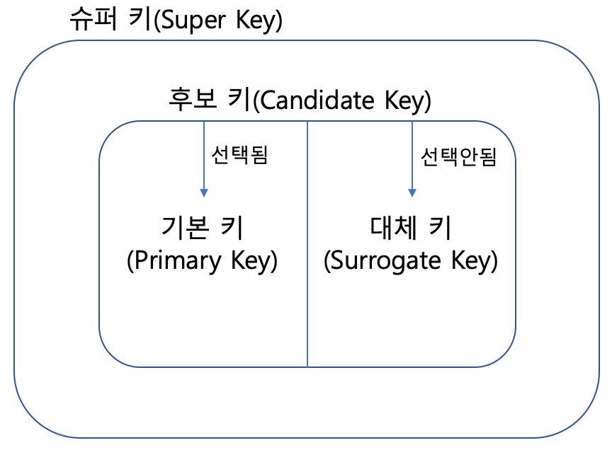

# 키의 종류

데이터 베이스에서 key의 종류로는 후보키(Candidate Key)/ 기본키(Primary Key)/ 대체키(Alternate Key)가 있다.

> **키(Key)**란 데이터베이스에서 조건에 만족하는 튜플을 찾거나 순서대로 정렬할 때 다른 튜플들과 구별할 수 있는 유일한 기준이 되는 속성(Attribute).

### 기본키(Primary Key)

테이블 내 동일한 레코드가 입력되는 경우 이를 구분해 줄 수 있는 식별자를 만들어 사용하는 데  이 식별자를 기본키라고 한다. 

> + **유일성**: 기본키를 구성하는 칼럼은 테이블에서 레코드를 식별할 수 있도록 유일해야 함
> + **최소성**: 유일성을 만족하는 한도 내에서 최소한의 칼람(하나 이상)으로 구성되어야 함
> + **개체 무결성**: 기본키가 가지고 있는 값의 유일성이 보장받아야 함.

+ 속성이 항상 고유한 값을 가져야 함.
+ 속성이 확실히 널 값을 가지고 있지 않아야 함
+ 속성의 값이 변경될 가능성이 높은 속성은 기본 키로 선정하지 않는게 O
+ 테이블에 기본키는 하나만 만들 수 있음

### 후보키(Candidate Key)

테이블에서 각 튜플을 구별하는 데 기준이 되는 하나 혹은 그 이상의 칼럼들의 집합

> **대체키(Alternate Key)**
>
> 후보키 중 기본키를 제외한 나머지 후보키

> **수퍼키(Super Key)**
>
> : 유일성을 만족하는 키/ {학번+이름},{주민등록번호+학번}
>
> 합성어라고도 불리는 수퍼키는 하나의 열이 키로 사용되는 것이 아닌 2개의 열이 합쳐서 기본키로 사용하는 것이다. 
>
> 수퍼키 안에 후보키 있다.

### 외래키(Foreign Key)

> ~~관계형 데이터베이스(RDBMS)에서 한 테이블의 필드 중 다른 테이블의 행을 식별할 수 있는 키를 말함~~
>
> 외래키란 테이블 내의 열 중 **다른 테이블의 기본키를 참조**하는 열
>
> --> 참조 무결성: 외래키는 참조하느 테이블에 실제로 있는 값만 사용할 수 있음.

외래키는 두 개의 테이블을 연결해주는 연결 다리 역할을 한다. 기본키가 중복된 데이터가 하나의 테이블에 삽입되는 것을 방지하는 역할을 하는 것처럼, 외래키 역시 비슷하게 문제를 방지하는 역할을 수행한다. 외래키는 새롭게 추가되는 행에서 외래키에 해당하는 값이 외래키가 참조하는 테이블에 존재하는지를 체크한다.

외래키는 두 개의 테이블을 연결하는 연결다리 역할을 하며, 참조하는 테이블에 무결성을 높여주는 역할을 한다.
