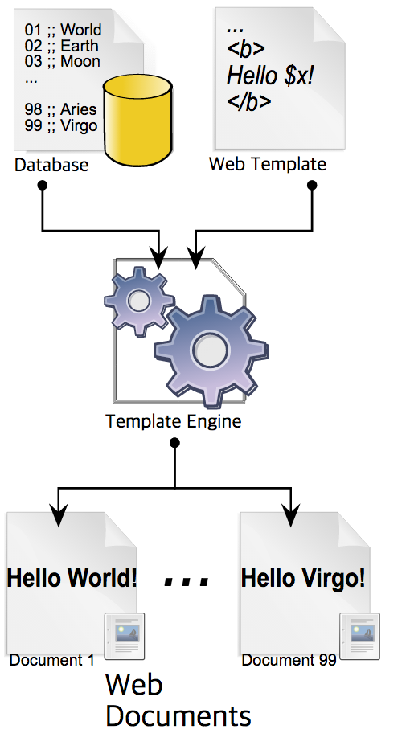

# 웹 템플릿 엔진(Web Template Engine)

### Template System

+ 템플릿 프로세서를 사용하여 웹 템플릿을 결합하여 완성된 웹 페이지를 만들어내는 시스템
+ 자료를 결합하여 페이지를 만들어 내기도 하고 많은 양의 Content를 표현하는 것을 도와준다.

템플릿 엔진이란 **동적 컨텐츠**를 생성하는 방법이다.

 템플릿 양식과 특정 데이터 모델에 따른 입력 자료를 결합하여 결과 문서를 출력하는 소프트웨어를 말하며 view code(html)과 data logic code(db connection) 을 분리해주는 기능을 한다.

**스프링 MVC에서 주로 동적인 View를 만드는데 사용**한다. 그렇다고 View만 만드는데 사용하지는 않으며 이메일 등 다양한 용도로 사용 가능하다.

#### 스프링 부트가 자동 설정을 지원하는 템플릿 엔진

- FreeMarker
- Groovy
- **Thymeleaf**
- Mustache

#### 템플릿 시스템의 종류

> 템플릿과 결합되는 위치에 따라 종류를 나눌 수 있다

+ server side : 서버에서 가져온 데이터를 미리 정의된 템플릿에 넣어 HTML을 그린 뒤 클라이언트에게 전달해준다.

  > HTML 코드에서 고정적으로 사용되는 부분은 템플릿으로 만들어두고, 동적으로 생성되는 부분만 템플릿에 소스코드를 끼워넣는 방식으로 동작한다

+ client side : HTML 형태로 코드를 작성하며, 동적으로 DOM을 그리게 해주는 역할을 한다. 

  > 데이터를 받아서 DOM 객체에 동적으로 그려주는 프로세스를 담당한다.

+ ...

#### 템플릿 시스템의 구성요소

 