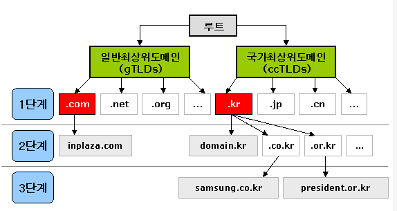

# DNS

> Domain Name System
>
> : 도메인 네임과 함께 거기에 해당하는 IP 주소값을 한 쌍으로 저장하고 있는 데이터베이스로서, 네트워크 내부에서 자동으로 수행된다.

+ 인터넷상에서 사용되는 도메인은 **전 세계적으로 고유하게 존재하는 이름**으로, 정해진 규칙 및 체계에 따라야 하며, 임의로 변경되거나 생성될 수 없다.

+ 인터넷의 DNS는 이름과 숫자 간의 매핑을 관리하여 마치 전화번호부와 같은 기능을 한다
+ `www.example.com`과 같이 사람이 읽을 수 있는 이름을 `192.0.2.10`과 같은 숫자 IP 주소로 변환하여 컴퓨터가 서로 통신할 수 있도록 한다.
+ DNS 서버는 이름에 대한 요청을 IP 주소로 변환하여 최종 사용자가 도메인 이름을 웹 브라우저에 입력할 때 해당 사용자를 어떤 서버에 연결할 것인지를 제어한다. 이 요청을 `쿼리`라고 한다.

### Domain 구조

+ 인터넷상의 모든 도메인은".(dot)"또는 루트라 불리는 도메인 아래에 역트리(Inverted tree) 구조로 계층적으로 구성되어 있음
+ 루트 도메인 바로 아래의 단계를 1단계 도메인 또는 최상위 도메인(TLD, Top Level Domain)이라고 부르며, 그 다음 단계를 2단계 도메인(SLD, Second Level Domain)이라고 함
+ 도메인은 일반최상위도메인(gTLD, Generic TLD)과 국가 최상위 도메인(ccTLD, Country Code)으로 구분할 수 있으며, gTLD는 다시 스폰서 도메인과 언스폰서 도메인으로 구분된다.

### 도메인 이름

| 최상위 도메인 | 뜻                                |
| :------------ | --------------------------------- |
| .com          | company의 약자                    |
| .net          | network 관련 회사                 |
| .org          | organization의 약자로 기관을 뜻함 |
| .gov          | government의 약자로 정부관련 기관 |
| .rec          | research의 약자로 연구소를 뜻함   |

> .com이나 .co.kr 또는 .net 등등은 사업자 등록증이 있어야만 등록할 수 있다.

> 도메인은 소유할 수가 없다. 일정기간(2년)동안 약간의 돈을 NIC(network information Center)에 내고 임대하는 것
>
> > 우리나라로 예를 들면, KNIC가 있어서 `.kr` 임대사업을 하기도 한다

+ 도메인 이름은 한 개 이상의 부분(레이블)로 이루어지고, 점으로 구분하여 붙여 쓴다
+ 가장 오른쪽 레이블은 최상위 도메인을 의미한다.
+ 각 레이블은 최대 63개 문자를 사용할 수 있고, 전체 도메인 이름은 253개 문자를 초과할 수 없다.

### DNS 서비스 유형

+ **신뢰할 수 있는 DNS**

  + 개발자가 퍼블릭 DNS 이름을 관리하는 데 사용하는 업데이트 매커니즘을 제공한다. 이를 통해 DNS 쿼리에 응답하여 도메인 이름을 IP 주소로 변환한다
  + 도메인에 대해 최종 권한이 있으며 재귀적 DNS 서버에 IP 주소 정보가 담긴 답을 제공할 책임이 있다
  + 대개 클라이언트는 신뢰할 수 있는 DNS 서비스에 직접 쿼리를 수행하지 않는다

+ **재귀적 DNS**

  + 호텔 컨시어지(집사)와 같은 역할을 한다.

    > DNS 레코드를 소유하고 있지 않지만 사용자를 대신해서 DNS 정보를 가져올 수 있는 중간자의 역할을 한다

  + 일정 기간동안 캐시된 또는 저장된 DNS 레퍼런스를 가지고 있는 경우, 소스 또는 IP 정보를 제공하여 DNS 쿼리에 답을 한다. 그렇지 않다면, 해당 정보를 찾기 위해 쿼리를 하나 이상의 신뢰할 수 있는 DNS 서버에 전달한다.