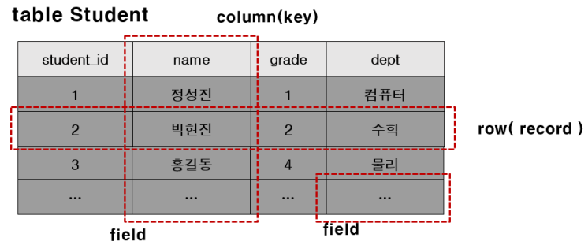
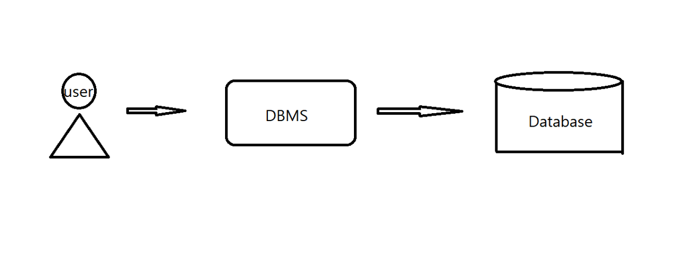

# DBMS

### 1. Database란?

일정한 체계 속에 저장된 데이터의 집합을 데이터 베이스라고 말한다. 

하나의 데이터베이스 안에는 여러 개의 <u>테이블</u>이 존재 할 수 있으며, 여러 개의 데이터 베이스를 둘 수 있다.

> 표 형식으로 저장된 데이터들의 집합을 테이블이라고 한다.

#### 데이터베이스의 목적

1. 데이터의 중복성 최소

2. 데이터의 공유

3. 데이터의 독립성

   > 하위 단계의 데이터 구조가 변경되더라도 상위 단계에 영향을 미치지 않음

4. 데이터의 무결성

   > 데이터의 정확성, 일관성, 유효성이 유지되는 속성

5. 데이터의 보안성

#### 데이터베이스 특징

1. 실시간 접근성 : 사용자의 요구를 즉시 처리할 수 있음
2. 계속적인 변화 : 삽입, 삭제, 수정 작업 등을 이용해 데이터를 지속적으로 갱신할 수 있음
3. 동시 공유성 : 여러 사람이 동일한 데이터에 접근하고 이용할 수 있음
4. 내용 참조 : 저장한 데이터 레코드의 위치나 주소가 아닌 데이터 값에 따라 참조할 수 있음

### 1-1. TABLE

**하나의 개체는 하나의 row(가로)**로, 각 개체가 가지는 **하나의 속성은 하나의 column(세로줄)**으로 표현됨

#### 테이블의 구성 요소

+ 테이블 : RDBMS의 기본적 저장구조 한 개 이상의 칼럼과 0개 이상의 row로 구성함

+ 열(column) : 테이블 상에서 단일 종류의 데이터를 나타냄. 특정 데이터의 타입 및 크기를 가짐

  -> 세로줄 

+ 행(row / record) : 칼럼들의 값의 조합으로 기본키(PK)에 의해 구분됨

+ 필드(field) : row와 column의 교차점(한 칸)으로 field는 데이터를 포함할 수 있고, 데이터가 없을 때는 null 값을 가지고 있음

### 2. DBMS

> DataBase Management System : 데이터베이스 관리 시스템

DBMS는 다수의 사용자들이 데이터베이스 내의 데이터를 접근할 수 있도록 해주는 소프트웨어를 말한다.

자료의 종속성과 중복성을 해결하기 위한 소프트웨어 시스템으로서, 모든 응용 프로그램들이 데이터베이스를 공유할 수 있도록 한다.

데이터베이스 구축은 DBMS를 선택하는 것부터 시작한다

DBMS의 종류로는 MySQL, MariaDB, ORACLE 등이 있다.

모든 DBMS는 <u>SQL</u>를 사용하지만, DBMS들은 표준 SQL을 완벽하게 지키지 않기 때문에 각 시스템마다 SQL이 차이가 있다.

> Structured Query Language : DBMS에 명령을 내리기 위해 사용하는 언어

데이터베이스는 책(정보)라면 데이터베이스 관리 시스템은 그 책을 관리하는 사서로 보면 될 것 같다

