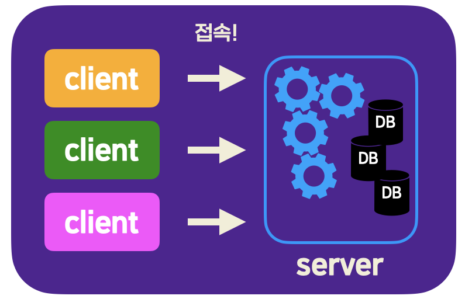

# DBMS와 S-C 구조

1. client : 사용자가 server에 접속해서 원하는 데이터베이스 관련 작업을 할 수 있도록, SQL을 입력할 수 있는 화면 등을 제공하는 프로그램

2. server : client로부터 SQL 문 등을 전달받아 데이터베이스 관련 작업을 직접 처리하는 프로그램

   > DBMS라고 할 때, 좁은 의미로 이 server 부분만을 가리키는 경우도 있다

위 사진을 보면 server 안에 DB가 포함되어 있는데, 데이터베이스는 DBMS와 분리된 것이 아니라, 이렇게 server가 직접 저장하고 관리하는 데이터의 집합인 것이다.

결국 DBMS를 사용한다는 것은, 실행되고 있는 server에 client를 이용해서 접속한 후, 원하는 명령을 내린다는 뜻이다.

MySQL에서 서버 프로그램의 이름은 **mysqld**이다. 이 프로그램이 실행되고 있을 때 사용자가 클라이언트 프로그램을 사용해서 접속하면 된다. 

MySQL의 클라이언트 프로그램의 이름은 **mysql**이다. mysql은 보통 <u>CLI</u> 환경에서 사용한다.

> Command Line Interface : 명령어를 키보드로 직접 입력하는 것 (ex> 유닉스, 리눅스)
>
> -> 컴퓨터를 더 단순하고 정확하게 사용할 수 있게끔 한다. 

MySQL을 CLI 환경에서 사용하는 것 : cmd

MySQL을 GUI 환경에서 사용하는 것 : MySQL Workbench