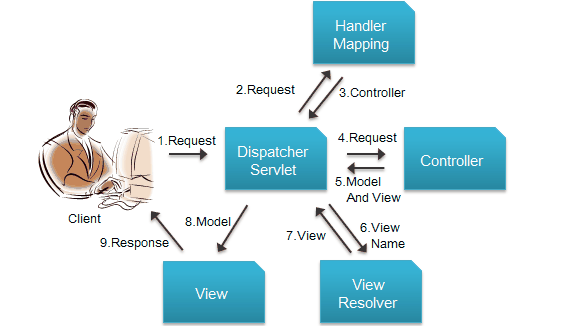
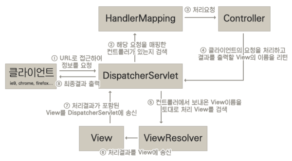
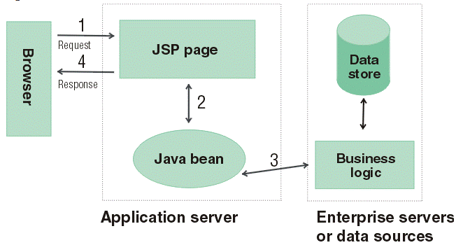
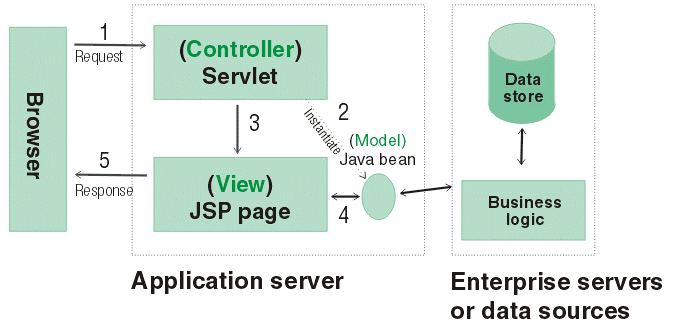

# Spring MVC Architecture

> Model, View, Controller를 분리한 디자인 패턴(개발자가 직접 구현해야 하는 것)
>
> → 최소한의 기능으로 Spring MVC를 사용하여 기본 프로그램을 세팅하는 것이 오래걸린다

+ **Model** : 애플리케이션 정보, 데이터 저리 관리

  + 애플리케이션의 상태(data)를 나타낸다
  + 일반적으로 POJO로 구성된다
  + **Java Beans**

  

+ **View** : 사용자 인터페이스(화면)

  + 디스플레이 데이터 또는 프리젠테이션
  + Model data의 렌더링을 담당하며, HTML output을 생성한다
  + **JSP**
  + JSP 이외에도 Groovy, 등 여러 Template Engine이 있다

  

+ **Controller** : Model과 View 간 상호동작 조정

  + View와 Model 사이의 인터페이스 역할
  + Model/View에 대한 사용자 입력 및 요청을 수신하여 그에 따라 적절한 결과를 Model에 담아 View에 전달한다. 즉, Model Object와 이 Model을 화면에 출력할 View Name을 반환한다.
  + Controller —> Service —> Dao —> DB
  + Servlet

#### DispatcherServlet

> Spring Framework가 제공하는 Servlet 클래스

+ Spring MVC의 핵심 구성 요소
+ 사용자의 Request를 관리
+ Dispatcher가 받은 Request를 HandelMapping에게 위임
+ Spring에서는 front controller는 DispatcherServlet이라고 하고 controller는 handler라고 말함

#### HandlerMapping

+ requestURL과 Controller 클래스의 매핑을 관리(`@RequestMapping`)
+ HandlerMapping 인스턴스의 정보로 매핑된 controller에게 위임

#### Controller

+ 요청에 매핑된 Controller 위임됨(`@Controller`)
+ @RequestMapping을 통하여 요청을 처리할 메소드에 호출
+ 필요한 비즈니스 로직을 호출
  + 해당 요청을 처리한 Service를 주입(DI) 받아 대신 DB에 접근(`@Repository`)
  + 결과 데이터를 다시 Controller에 전달
+ View에 전달할 결과 데이터(Model)와 이동할 화면(View) 정보를 스프링 MVC가 제공하는 ModelAndView 인스턴스에 담아 DispatherServlet에 반환
+ DispatherServlet은 ViewResolver에게 뷰 논리정보(View Name)를 전달

#### ModelAndView

+ Controller에서 처리 결과를 View에 전달할 결과 데이터(Model)와 이동할 화면(View) 정보를 담는 클래스
+ Controller 메소드에서 리턴타입이 String이어도 핸들러(controller)에서 ModelAndView 인스턴스에 View 정보를 넣음

#### ViewResolver

+ ViewResolver는 View Name을 이용해 알맞는 view 객체를 찾음
+ View에 model을 rendering하여 View 인스턴스를 다시 DispatherServlet에 보냄
+ DispatcherServlet은 최종 결과를 클라이언트에 응답

#### View

결과 데이터인 Model 객체를 보여줌

____

### MVC Model 1 아키텍처

브라우저가 요청을 하게되면 해당 요청을 JSP가 받게된다. 따라서 요청만큼 JSP 페이지가 존재해야 한다. 이런 JSP는 Java로 만들어진 클래스인 Java Bean을 이용해서 데이터베이스를 사용하게 되고, 이 결과를 화면에 출력하는 일을 하게 된다. 

> JSP 자체에 Java 코드와 HTML 코드들이 섞여있게 되다보니 유지보수가 어려워졌음

### MVC Model2 아키텍처

요청 자체를 서블릿이 받게하고, 서블릿이 Java Bean을 이용해 DB에서 데이터를 꺼내오고, 이런 결과들을 JSP를 통해 결과를 화면에 보여주게 한다

위 그림에서 서블릿은 요청과 데이터를 처리하는 컨트롤러의 역할을 수행하고, JSP는 모델의 결과를 보여주게하는 View의 역할을 하고 있다. 이렇게 함으로써 로직과 뷰를 분리할 수 있게 된다