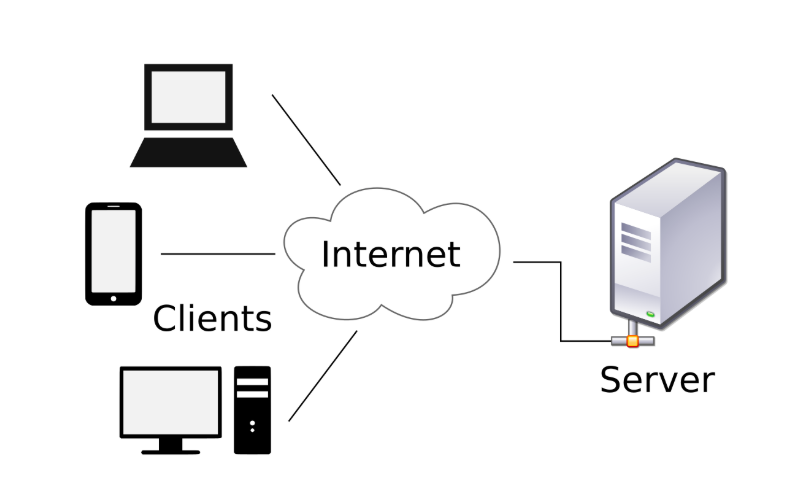

# 클라이언트와 서버

**클라이언트**란 영어 뜻 그대로 고객, 손님. 즉, 서비스를 사용하는 사용자를 말함

자세하게 설명하면 통신망에 연결된 여러 컴퓨터들은 서버에서 필요한 정보를 받거나, 서버에서 처리할 데이터를 보내기도하고 그 결과를 받기도 하는것, 즉 ''서버와 정보를 주고받는 것'이다

간단하게 말하면 __서버로부터 받아온 정보를 보여주는 것__ (ex>노트북, 컴퓨터, 스마트폰)

**서버**란 클라이언트에게 네트워크를 통해 서비스를 제공하는 장치이다. __클라이언트가 요구한 정보를 DB에서 찾아서(?) 클라이언트에게 제공해주는 것__

-> 클라이언트가 인터넷을 통해 무언가 요청을 하면 서버에서 그것을 해결하고 결과를 반환해주는 기능 등을 함.

