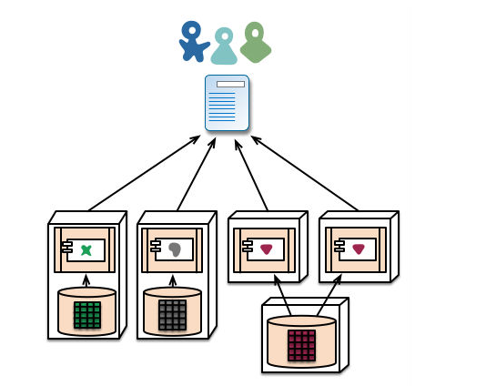

# MSA

> <u>Micro Service</u> Architecture
>
> > 전체 애플리케이션을 **특정 목적을 가진 어플리케이션 단위**로 나누는 것

##### 아키텍처

: 컴퓨터를 기능면에서 본 구성 방식. 기억 장치의 번지 방식, 입출력 장치의 구성 방식 등을 가리킴

## Monolithic Architecture

: 기본적인 웹 시스템 개발 스타일로, 하나의 애플리케이션 내에 모든 로직들이 모두 들어가 있는 "통짜 구조"

> 한 덩어리로 뭉친 거대 단일 서비스 개발방식

**소규모 프로젝트에 합리적**인 아키텍처이다.

> 간단하고 유지보수가 용이하기 때문

일정 규모 이상의 서비스에서는 한계를 보인다

+ 서비스/프로젝트가 커질수록, 영향도 파악 및 전체 시스템 구조 파악에 어려움이 있다
+ 빌드 시간 및 테스트시간, 그리고 배포시간이 기하급수적으로 늘어난다
+ 서비스를 부분적으로 scale-out하기 힘들다
+ 부분의 장애가 전체 서비스의 장애로 이어지는 경우가 발생한다

## Micro Service Architecture

Monolithic 아키텍처의 대안으로 등장한,

***"하나의 큰 어플리케이션을 여러개의 작은 어플리케이션으로 쪼개어 변경과 조합이 가능하도록 만든 아키텍쳐"***

서비스나 프로젝트가 크고, 복잡하고, 장기적으로 운영될수록, MSA의 장점이 더욱 드러나게 된다

서비스를 여러개로 나누어 각각 서비스를 담당할 서버 및 데이터베이스를 함께 나누어준다

 어떤 서비스냐에 따라 같은 서버를 사용하거나 같은 데이터베이스를 사용하는 등 유기적인 구조가 가능하다

클라이언트가 요청을 보내면 각각의 서비스들이 담당한 내용에 대한 응답을 클라이언트에게 보내준다.

### 특징

1. **데이터를 공유하지 않는다**

   각각의 서비스마다 디비를 나누거나 테이블 접근 권한을 걸어 놓고 독립적으로 서비스를 개발한 후에 본인 접근권한 밖의 데이터가 필요할 때는 해당 데이터를 다루는 API에 요청한다.

2. **MSA는 API를 통해서만 상호작용할 수 있다**

   end-point(접근점)을 API 형태로 외부에 노출하고, 실질적인 세부 사항은 모두 추상화한다

   내부의 구현 로직, 아키텍처와 프로그래밍 언어, 데이터베이스, 품질 유지 체계와 같은 기술적인 사항들은 서비스 API에 의해 철저하게 가려진다

   따라서 **SOA**(Service Oriented Architecture)의 특징을 다수 공통으로 가진다

   >  서비스 지향 아키텍처 

3. **마이크로서비스는 가볍다**

   하나의 비즈니스 범위에 맞춰 만들어지므로 하나의 기능만 수행한다. 그 결과 마이크로서비스는 작은 공간만을 차지하게 된다

4. **다양한 언어로 구성할 수 있는 마이크로 서비스**

   >  마이크로서비스는 자율적이고 모든 것을 추상화해 서비스 API 뒤에 숨기기 때문에 서로 다른 마이크로서비스에서 서로 다른 아키텍처를 적용할 수 있다

### 장점

1. 코드의 수정 및 추가 용이

2. 효율적인 자원 사용 가능

3. 개별 서비스 단위의 배포 가능

   > 요구사항을 신속하게 반영하여 빠르게 배포할 수 있음

4. 서비스별로 다른 프레임워크 및 개발 언어 사용 가능

### 단점

+ 성능

   - 서비스 간 호출 시 API를 사용하기 때문에, 통신 비용이나, 지연 시간이 그만큼 늘어남

+ 테스트 / 트랜잭션 
  - 서비스가 분리되어 있기 때문에 테스트와 트랜잭션의 복잡도가 증가하고, 많은 자원을 필요로 함
+ 데이터 관리 
  - 데이터가 여러 서비스에 걸쳐 분산되기 때문에 한 번에 조회하기 어렵고, 데이터의 정합성 또한 관리하기 어려움

