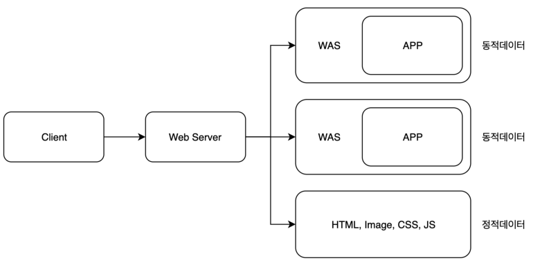

# WS와 WAS

### WS

: HTTP 프로토콜을 기반으로 하여 클라이언트(웹 브라우저 또는 웹 크롤러)의 요청을 서비스 하는 기능

##### 기능

> 두 가지 기능 중 적절하게 선택하여 수행

1.  **정적**파일에 대한 요청인가?(-WAS 안 거침)

   + 정적인 컨텐츠 제공
   + WAS를 거치지 않고 바로 자원 제공

2. **동적**파일에 대한 요청인가? ( -WAS 거침)

   + 동적인 컨텐츠 제공을 위한 요청 전달

   + 클라이언트의 요청을 WAS에 보내고, WAS가 처리한 결과를 클라이언트에게 전달

     > 클라이언트는 일반적으로 웹 브라우저를 의미

____

### WAS

> WAS = Web Server + Web Container

+ DB 조회나 다양한 로직 처리를 요구하는 동적인 컨텐츠를 제공하기 위해 만들어진 application server

+ HTTP를 통해 컴퓨터나 장치에 애플리케이션을 수행해주는 미들웨어(소프트웨어 엔진)

+ "웹 컨테이너(Web Container)" 혹은 "서블릿 컨테이너(Servlet Container)"라고도 불림

  > Container란 JSP, Servlet을 실행시킬 수 있는 소프트웨어를 말함
  >
  > 즉, **WAS는 JSP, Servlet 구동 환경을 제공**한다

##### 주요 기능

+ 프로그램 실행 환경과 DB 접속 기능 제공
+ 여러 개의 트랜잭션(논리적인 작업 단위) 관리 기능
+ 업무를 처리하는 비즈니스 로직 수행

##### 필요한 이유

웹 페이지는 정적 컨텐츠와 동적 컨텐츠가 모두 존재하는데, 사용자의 요청에 맞게 적절한 동적 컨텐츠를 만들어서 제공해야 한다. WAS를 통해 요청에 맞는 데이터를 DB에서 가져와서 비즈니스 로직에 맞게 그때 그때 결과를 만들어서 제공함으로써 자원을 효율적으로 사용할 수 있다.

대표적인 WAS로는 Tomcat, JBoss, Jeus, Web Sphere 등이 있다

____

### WS와 WAS 구분하는 이유

: 자원 이용의 효율성 및 장애 극복, 배포 및 유지보수의 편의성을 위해 Web Server와 WAS를 분리한다.

Web Server를 WAS 앞에 두고 필요한 WAS들을 Web Server에 플러그인 형태로 설정하면 더욱 효율적인 분산 처리가 가능하다

> 클라이언트에서 서버에 HTTP 요청을 보내면 웹 서버가 해당 내용이 정적파일에 대한 요청인지 확인 후 맞으면 그대로 응답하고, 아니라면 WAS에 요청을 넘긴다.

