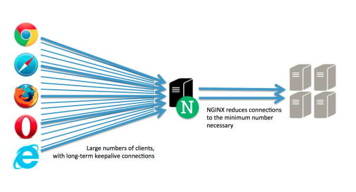
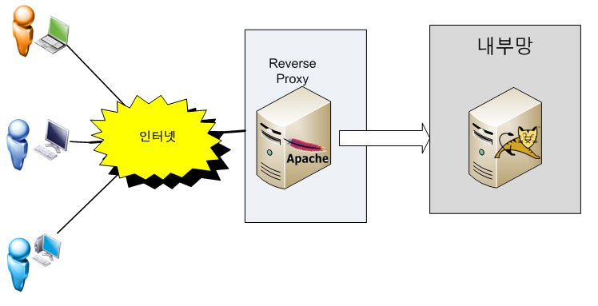

# NGINX

: **웹 서버 소프트웨어**로, Apache보다 동작이 단순하고, 전달자 역할만 하기 때문에 동시접속 처리에 특화되어 있다. (가볍고, 성능이 좋은 엔진)

 `웹 서버`, `리버스 프록시` 및 `메일 프록시` 기능을 가진다

+ NGINX는 요청에 응답하기 위해 <u>**비동기 이벤트 기반 구조**</u>를 가짐

  이것은 아파치 HTTP 서버의 스레드/프로세스 기반 구조를 가지는 것과는 대조적

  이러한 구조는 서버에 많은 부하가 생길 경우의 성능을 예측하기 쉽게 해줌

+ Apache보다 **동작이 단순하고 동시접속 처리에 특화**됨

  > 확장 모듈이 Apache보다 부족하지만, 신규 서비스를 중심으로 점유율이 상승하고 있다

+ 단일 서버에서도 수만 개의 동시 연결을 처리할 수 있다
+ 분산 메모리 객체 캐시 시스템이 추가됨

동시접속자(약 700명) 이상이라면 서버를 증설하거나 NGINX 환경을 권장한다고 한다.

____

### 리버스 프록시 (Revrse proxy)

> 외부에서 내부 서버가 제공하는 서비스 접근시, proxy 서버를 먼저 거쳐서 내부 서버로 들어오는 방식

: 클라이언트로부터의 요청을 받아서(필요하다면 주위에서 처리한 후) 적절한 웹 서버로 요청을 전송

+ 웹 서버는 요청을 받아서 평소처럼 처리를 하지만, 응답은 클라이언트로 보내지 않고, reverse proxy는 WAN -> LAN의 요청을 대리

  > WAN (Wide Area Network) : LAN과 LAN 사이를 광범위한 지역 단위로 구성하는 네트워크
  >
  > LAN (Local Area Network) : 사용자가 포함된 지역 네트워크

+ 클라이언트로부터의 요청이 웹서버로 전달되는 도중의 처리에 끼어들어서 다양한 전후처리를 시행할 수가 있게 됨.

#### 장점

1. **보안**

   : 외부 사용자는 실제 내부망에 있는 서버의 존재를 모른다. 모든 접속은 reverse proxy 서버에게 들어오며, reverse proxy는 요청에 맵핑되는 내부 서버의 정보를 알고 요청을 넘겨준다.

   따라서 **내부 서버의 정보를 외부로부터 숨길 수 있다**

2. **로드밸런싱**

   > 서버에 가해지는 부하(=로드)를 분산(=밸런싱)해주는 장치 또는 기술

   : proxy 서버가 내부 서버의 정보를 알고 있으므로 로드밸런싱을 통해 부하 여부에 따라 요청을 분배할 수 있다.

> 인터넷이 웹서버(NGINX, Apache)로 요청을 보내면 실제 내부망의 서버(톰캣)로 넘겨줌.