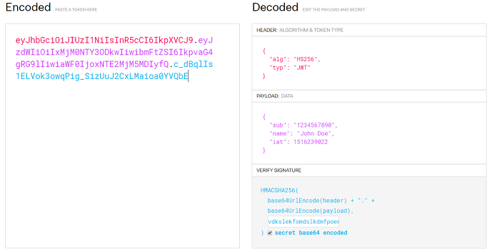

# Json Web Token

: Json 포맷을 이용하여 사용자에 대한 속성을 저장하는 Claim 기반의 Web Token


#### 역할

1. **회원 인증** : JWT를 사용하는 가장 큰 이유. / 서버가 클라이언트에게서 요청을 받을 때 마다, 해당 토큰이 **유효하고 인증이 됐는지** 검증을 하고 작업에 대해 **권한이 있는지** 확인
2. **정보 교류** : JWT는 두 개체 사이에서 **안정성있게 정보를 교환**하기에 좋은 방법이다. 정보가 sign되어있기 때문에 검증이 쉬움.

> 토큰의 종류
>
> 1. **Oauth** : Random String으로 특별한 정보를 가지고 있지 않음. 서버에서는 이 토큰을 이용하여 다시 관련된 정보를 찾아야 하기 때문에 부담
> 2. **Claim** : 토큰 자체에 정보들이 담겨있는 것으로 JWT가 대표적


____


### 토큰의 구성

3가지의 문자열로 이루어졌으며 점으로 구분한다. Json 형태인 각 부분은 <u>Base64</u>로 인코딩(암호화) 되어 표현된다.



출처 : https://mangkyu.tistory.com/56

> Base64 (64진법) 인코딩은 평문이나 마찬가지

`헤더(header).내용(payload).서명(signature)`

`aaaaaaa.bbbbbbbbbbbb.ccccccccccccc`


### Header

-typ : **토큰의 타입**을 지정

-alg : <u>**해싱 알고리즘**</u>을 지정함(HMAC SHA256 혹은 RSA)

​		-> Signature 및 토큰 검증에 사용

> **Hashing algorithms**
>
> : 암호화 해시 함수/ 임의 크기의 데이터를 고정 크기의 해시에 매핑하는 수학적 알고리즘

> **Hash**(해시)란 **단방향 암호화 기법**으로 해시함수(해시 알고리즘)를 이용하여 고정된 길이의 암호화된 문자열로 변환시키는 것
>
> 해시함수(hash function)는 임의의 길이의 데이터를 고정된 길이의 데이터로 매핑하는 함수입니다. 이 때 매핑 전 원래 데이터의 값을 키(key), 매핑 후 데이터의 값을 해시값(hash value), 매핑하는 과정을 해싱(hashing)이라 함.

```java
{//HMAC SHA256
  "typ": "JWT",
  "alg": "HS256"
}
```


### Payload

: 토큰에서 사용할 정보(유저의 고유 ID 등 인증에 필요한 정보)의 조각들인 클레임이 담겨 있다.

> **payload에 담기는 값은 토큰 만드는 사람 맘대로 커스터마이징(주문제작) 가능**

+ exp 항목에 만료되는 시간을 넣어서 토큰이 만료된 것인지 아닌지 확인해줌


+ **클레임(Claim)** : 정보의 한 조각

  + 하나의 key, value 쌍으로 된 형태로 다수의 정보를 넣을 수 있음

  1. **등록된(registered) 클레임**

     : APP의 서비스에 필요한 정보가 아닌, 토큰의 정보를 표현하기 위해 이미 정해진 종류의 데이터. 

     모든 registered claim은 선택적

     > 사용자 이메일을 주로 사용함

  2. **공개(public) 클레임**

     : 사용자 정의 클레임으로, 공개용 정보를 위해 사용된다. 충돌 방지를 위해 URI 포맷 이용

  3. **비공개(private) 클레임**

     : 사용자 정의 클레임으로, 서버와 클라이언트 사이에 임의로 지정한 정보를 저장

  

### Signature

: 토큰을 인코딩하거나 유효성 검증을 할 때 사용하는 고유한 **암호화 코드**

헤더의 인코딩 값과 정보의 인코딩값을 합친 후 비밀키로 해쉬를 하여 생성함.

간단히 자신이 원하는 문자열로 내용을 인코딩한다고 생각하기


 **Header, Payload, Signature 중 어느 한 부분이라도 변조되면 토큰은 무효화된다!**

____


**access token**(짧은 유효기간)-> 서버한테 없음

**refresh token**(긴 유효기간)-> 서버가 갖고 있음

+ Access token은 짧은 유효기간을 가지고 있음.

   Access token이 만료되었을 때, 새로운 Access token을 발급 받도록 하는 것이 Refresh token


+ Refresh token이 만료되면 로그인 창을 다시 불러옴.
+ 헤더에 Refresh token을 넣고 Access token을 받아옴


