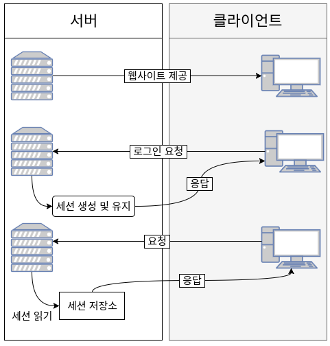
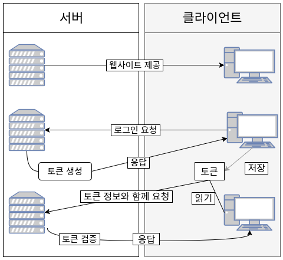

# 서버 기반 인증 vs 토큰 기반 인증

> 현대 웹서비스에서 API를 이용한 웹서비스를 개발할 때, 토큰을 사용하여 사용자들의 인증 작업을 처리하는 것이 가장 좋은 방법

### [서버 기반 인증 시스템]

-> Stateful Server : 상태 유지 서버

: 기존의 인증 시스템, **서버 측에서 사용자들의 정보를 기억하기 위해 메모리나 DB 등을 통해 세션을 관리**하는 방식

> ex) 사용자가 로그임을 하면, 세션에 사용자 정보를 저장해두고 서비스를 제공할 때 사용

> 서버 기반 시스템의 흐름

1. 서버가 클라이언트에게 웹사이트 제공
2. 클라이언트가 서버에 로그인을 요청하면 서버에서는 세션을 생성해서 저장해둔 다음에 응답
3. 클라이언트가 요청을 보내면 세션 저장소에 있는 세션을 읽어서 응답

#### 서버 기반 인증의 문제점

: 소규모 시스템에서는 아직 많이 사용되고 있지만, 다음과 같은 문제점 때문에 토큰 기반 인증 시스템을 사용하게 되었다.

1. **세션**

   : 사용자 인증을 위해 서버가 메모리에 저장한 정보.

   로그인 중인 사용자가 늘어날 경우 서버의 RAM(또는 DB)에 부하가 걸림. 

2. **확장성**

   : 사용자가 늘어나게 되면 더 많은 <u>트래픽</u>을 처리하기 위해 여러 프로세스를 돌리거나 컴퓨터를 추가하는 등 서버를 확장해야 한다. 세션을 사용할 때는 세션을 분산시키는 시스템을 설계해야 하지만 매우 어렵고 복잡하다

   > 트래픽(traffic) : 통신망을 통과하는 정보의 흐름

3. **CORS**(Cross-Origin Resource Sharing)

   > 교차 출처 리소스 공유

   : 웹 애플리케이션에서 세션을 관리할 때 자주 사용되는 쿠키는 단일 도메인 및 서브 도메인에서만 작동하도록 설계되어 있다. 세션을 사용한다면 세셔을 분산시키는 시스템을 설계해야 하지만 이러한 과정은 매우 어렵고 복잡하다

____

### [토큰 기반 인증 시스템]

-> Stateless Server : 상태 비저장 서버

: 인증받은 사용자들에게 토큰을 발급하고, 서버에 요청을 할 때 헤더에 토큰을 함께 보내도록 하여 유효성 검사를 한다

> 시스템에서 사용자의 인증 정보를 서버나 세션에 유지하지 않고 클라이언트 측의 요청만으로 작업을 처리한다

> 토큰 기반 시스템의 흐름

1. 서버가 웹 사이트를 제공

2. 클라이언트가 로그인을 요청하면 서버에서는 토큰을 생성해서 응답

3. 클라이언트는 전달받은 토큰을 저장해두고 요청할 때마다 서버에 전달

   (Http 요청 헤더에 토큰 포함시킴)

4. 서버는 토큰을 검증 후 요청에 응답

#### 토큰 기반 인증 시스템의 이점

1. **무상태성&확장성(Scalability)**

   > 토큰을 사용한다면 어떠한 서버로 요청이 와도 상관 없다 (시스템의 확장성)

2. **보안성**

3. **확장성(Extensibility)**

   > 로그인 정보가 사용되는 분야에서의 확장성

   : 토큰 기반 인증 시스템에서는 토큰의 선택적인 권한만 부여하여 발급할 수 있으며, <u>OAuth</u>의 경우 소셜 계정을 이용하여 다른 웹서비스에서도 로그인을 할 수 있다.

   > OAuth
   >
   > : 별도의 회원가입 없이 로그인을 제공하는 것(네이버로 로그인, 페이스북으로 로그인...)
   >
   > 외부 서비스에서도 인증을 가능하게 하고 그 서비스의 API를 이용하게 해주는 것

4. **여러 플랫폼 및 도메인**

   : CORS를 해결하여 어떤 디바이스, 어떤 도메인에서도 토큰의 유효성 검사를 진행한 후에 요청을 처리할 수 있다. 

##### 최근에는 JSON 포맷을 이용하는 JWT(JSon Web Token)를 주로 사용한다.