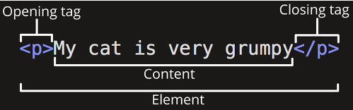
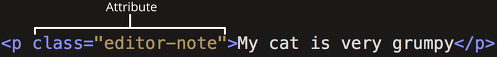

# 2. 기본 프론트엔드 지식(1)


## HTML

**웹사이트의 몸체**

> Hyper Text Markup Language
>
> : HyperText(웹 페이지에서 다른 페이지로 이동할 수 있도록 하는) 기능을 가진 문서를 만드는 언어

> HTML 문서는 단순히 텍스트 파일에 불과하고 웹 브라우저가 해석을 해서 구조를 통해 화면에 렌더링 해주게 되고 사용자는 View라고 하는 스크린을 통해 접하게 됨.






+ open tag - 여는 태그 / close tag - 닫는 태그

  > 콘텐츠를 감싸기 위함 / 요소가 다른 요소를 감싸기 위해

+ close tag가 없는 HTML 요소 - 콘텐츠(contents)를 감싸기 않아 비어있다는 의미

+ element - 요소

+ attribute - 속성

  `<tagname attribute="value">콘텐츠</tagname>`


#### DTO (DOCTYPE or Document Type Definition)

`<!DOCTYPE (문서 유형)>`

+ 태그가 아니라 선언문으로서의 역할이기 때문에 HTML 문서의 반드시 최상 위에 위치
+ 문서 유형(HTML5, HTML4,XHTML 세가지 문서 유형 존재)에 따라 마크업 문서의 요소와 속성등을 처리하는 기준이 되고, 유효성 검사에 이용


```html
<!DOCTYPE html>
<html lang="en">
<head>
    <meta charset="UTF-8">
    <title>자기소개</title>
  <link rel="stylesheet" href="style.css">
</head>
<body>
<h1>랄랄라</h1>
<h2>생년월일: 2000년 0월 0일</h2>
<h2>희망 전공: 백엔드</h2>
<p> 많이 부족하지만, 열심히 하겠습니다!!</p>
<p>랄랄라</p>


</body>
</html>
```


____


HTML문서인 웹 페이지는 head 영역과 body 영역으로 구성됨

**<head>** : 문서의 서문의 시작과 끝을 알림

> 콘텐츠를 표현하는 내용은 없지만 콘텐츠를 표현하기 위한 내용들 포함

**<meta>** :  문서자체를 설명

< head>태그 안에서 사용

> 문서의 정보(웹페이지의 요약)를 브라우저와 검색엔진에 이 문서가 어떤 정보를 가지고 있는지 알려주는 것을 명시함

< title> : 문서의 제목을 나타내 줌

> 문서의 정보를 브라우저에 표시하는 역할

< link> : 외부자원(external file)

**<body>** : 문서 본문의 시작과 끝을 알림

> 웹 페이지에 표현되는 콘텐츠 작성


____

< center> < /center> : 텍스트나 이미지 등을 문서 중앙에 위치하게 해 주는 태그

< br> : 문장을 다음 줄로 넘길 때 사용하는 태그/ 엔터

> < img>,< br>,< hr> 등과 같이 종료 태그 없이 시작 태그만을 가지는 태그를 빈 태그(empty tag)라 함

< p> : 문단 구분할 때 사용 / 한 줄의 빈줄을 남기고 줄을 구분함

...


## CSS

**웹사이트의 옷과 악세서리**

> Cascading Style Sheet (종속형 시트)
>
> : 마크업 언어가 실제 표시되는 방법을 기술하는 언어

-> 주로 HTML과 XHTML에 주로 쓰임


#### 특징

+ 다양한 문법을 가짐
+ 수많은 영어 키워드를 사용
+ 다양한 스타일의 프로퍼티의 이름 규정
+ HTML에 CSS의 키워드를 넣을수도 있음


```CSS
h1{color: blueviolet;}
h2{color: rebeccapurple;}
h3{color: midnightblue;} 
//색깔 정하기
```


> HTML과 CSS는 정적인 언어이다.
>
> > 브라우저를 통해서 웹페이지를 화면에 그려주면 이 화면을 변경할 수 있는 방법이 없다는 것