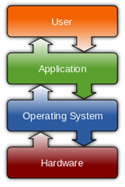

# OS의 일반적인 작동 방식

> **운영체제(OS, Operating System)** -> 중재자
>
> : 컴퓨터 하드웨어의 성능을 최대한 효율적으로 운영하기 위해 하드웨어와 사용자 사이에 있는 프로그램
>
> > 컴퓨터를 사용하기 위해서 먼저 설치 해야하는 기본 s/w

### 목적

+ 처리능력(Throughput) : 시스템의 생산성을 나타내는 단위로, 일정 시간 동안 처리하는 일의 양
+ 응답시간(Turnaround Time) : 작업 의뢰 후 시스템에서 결과가 얻어질 때까지의 시간
+ 신뢰도(Reliablility) : 주어진 문제를 얼마나 정확하게 처리하는가의 정도
+ 사용 가능도(Availability) : 시스템을 얼마나 빠르게 사용할 수 있는가의 정도

> **컴퓨터 하드웨어의 성능을 최대한 효율적으로 운영하기 위해**

#### 대표적인 OS

+ Windows

  > 마이크로소프트사가 내놓은 windows OS
  >
  > 개인과 비지니스로 구분되어 세계적으로 널리 보급되고 있음

+ Linux

  > 판매를 통해 수익을 얻고자 하는 개발자와 무상으로 제공하자는 개발자로 나뉘어 꾸준하게 개발되고있음

+ Mac OS

  > GUI 시대를 여는데 많은 공헌을 한 OS

+ android

  > 리눅스 커널을 기반으로 구글에서 제작한 모바일 운영체제
  >
  > 대표적인 오픈 소스 플랫폼이며 세계 최다 사용자를 보유한 운영체제

+ ios

  > 애플이 개발 및 제공하는 모바일 운영체제

### 기능

+ 하드웨어를 쉽게 사용할 수 있도록!
+ 효율적으로 사용할 수 있도록!

### 구성

+ **제어 프로그램(Control Program)**

  > 시스템 전체의 동작 상태를 감독하고 지원. 제어 프로그램의 중추적 역할을 담당

  + 감시 프로그램(Supervisor Program)

    > 컴퓨터 시스템 전체의 작동 상태를 감시, 감독하는 프로그램

  + 작업 관리 프로그램(Job Management Program)

    > 작업 관련 데이터의 준비와 처리를 관리하는 프로그램

  + 데이터 관리 프로그램(Data Management Program)

    > 여러 종류의 데이터와 파일을 관리해 주는 프로그램

+ **처리 프로그램(Process Program)**

  > 제어 프로그램 감시하에 컴퓨터의 특정한 문제를 해결하기 위한 필요한 여러가지 기능을 처리할 수 있도록 해주는 프로그램입니다. 회사 측에서 제공해주는 프로그램과 사용자가 작성한 문제 해결 프로그램이 있습니다.

  + 언어 번역 프로그램(Language Translator)

    > 원시 프로그램을 기계어로 번역하기 위한 프로그램

    > 컴파일러, 어셈블러, 인터프리터 등

  + 서비스 프로그램(Service Program)

    > 시스템에서 사용 빈도가 높은 프로그램을 미리 개발하여 놓은 프로그램

    > 연계 편집 프로그램, 로더, 디버깅 프로그램, 라이브러리 등

  + 문제 처리 프로그램(Problem Processing Program)

    > 사용자가 업무에 적용하여 그에 따라 작성하는 프로그램

    > 급여 관리, 인사 관리, 회계 관리 등

