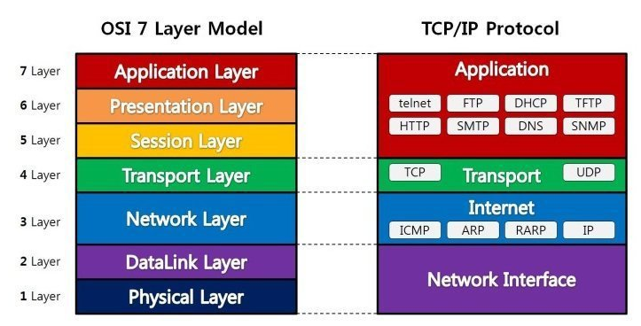
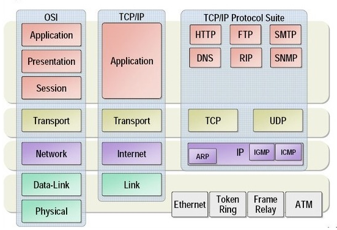
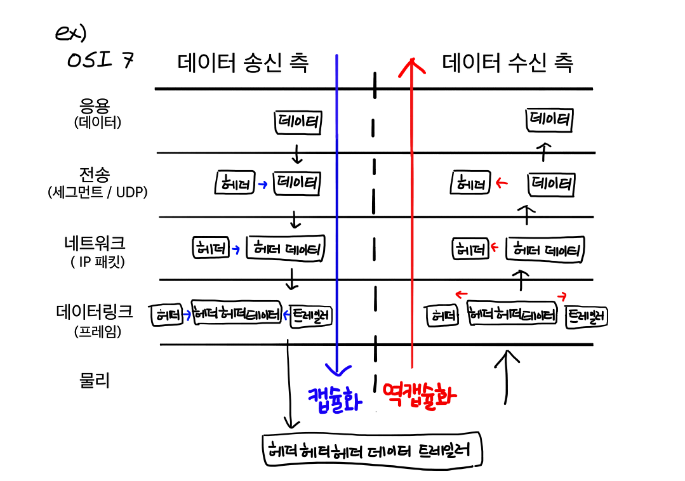

# OSI 7 계층

> Open Systems Interconnection

: 네트워크에서 통신이 일어나는 과정을 7단계로 나눈 것

: 컴퓨터 네트워크 <u>프로토콜</u> 디자인과 통신을 계층으로 나누어 설명한 것

> 프로토콜(protocol)  : 통신 규약, 
>
> 송수신자 사이에서 "데이터 구조는 이래저래~", "이건 이런 의미임!!", "속도는 요정도가 적당쓰!" 하는거

물-데-네-전-세-표-응

위와 같이 계층을 나눈 이유는 **전문성**을 향상시키고, **유지보수**의 편의를 위해서이다

통신이 일어나는 과정을 세분화 시킴으로써 전문성이 향상된다

7단계 중 특정한 곳에 이상이 생기면 다른 단계를 건들이지 않고 이상이 생긴 단계만 고칠 수 있어 수리가 편리해진다

> OSI와 프로토콜

> 캡슐화와 역캡슐화

