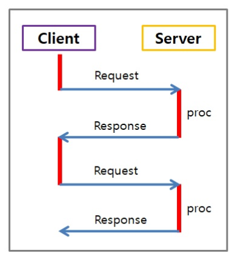
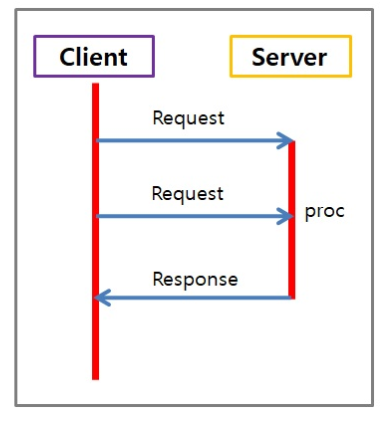

## 동기 (Synchronous)

: 한 문자의 단위가 아니라 미리 정해진 수 만큼의 문자열을 한 묶음으로 만들어서 일시에 전송하는 방법

: `호출된 함수`의 수행 결과 및 종료를 `호출한 함수`(호출된 함수 뿐 아니라 호출한 함수도 함께)가 신경쓰는 것

> **요청과 그 결과가 동시에 일어난다는 약속**

+ 특징
  + 비동기식에 비해 전송효율이 높다는 것이 장점이지만 수신측에서 비트 계산을 해야한다
  + 문자를 조립하는 별도의 기억장치가 필요하므로 가격이 다소 높다

+ 동작방식

  + 송신측에서 2진 데이터들을 정상적인 속도로 내 보내면, 수식측에서는 <u>클록</u>의 한 사이클 간격으로 데이터 인식 

    > 동작하는 순간(행동하는 타이밍)을 제어하기 위한 시간 정보

설계가 매우 간단하고 직관적이지만, 결과가 주어질 때까지 아무 것도 못하고 대기해야 한다

## 비동기 (Asynchronous)

: 데이터 전송을 마치기 전에 기타 프로세스가 계속하도록 허가하는 입출력 처리의 한 형태

: `호출된 함수`의 수행 결과 및 종료를 `호출한 함수` 혼자 직접 신경쓰고 처리하는 것

> **요청과 결과가 동시에 일어나지 않을 거라는 약속**

+ 특징

  + <u>노드</u> 사이의 작업 처리 단위를 동시에 맞추지 않아도 된다

    > 작업을 행하는 주체

  + 필요한 접속 장치와 기기들이 간단하므로 동기식 전송 방비보다 값이 싸다

+ 동작방식
  + 송신측의 송신 클록에 관계없이 수신신호 클록으로 타임 슬록의 간격을 식별하여 한 번에 한 문자씩 송수신

A라는 행위와 B라는 행위가 동시(or 순차적이지 않다면)에 실행되고 있으면 비동기

> **BUT!!** A, B 행위 사이에는 인과관계가 있어야 한다

동기보다 복잡하지만, 결과가 나오는 시간 동안 다른 작업을 할 수 있으므로 자원을 효율적으로 사용할 수 있다