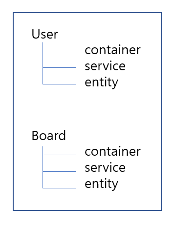

# DDD

Domain Driven Design 도메인 주도 설계

여러가지 도메인이 서로 상호작용하며, 설계하는 것이 도메인 주도 설계이다.

> 이런식으로 패키지 구조를 짜는 것이 DDD

각각의 도메인들을 계층으로 철저히 분리해서 만든 것이 DDD의 핵심 설계 방식

설계한 도메인들을 모듈별로 분리하는 것이 MSA

#### Bounded Context

"어떠한 상황에서 바라볼 것인가?"

Bounded Context에 따라서 Model의 역할은 완벽히 달라지고, 책임 또한 달라지게 된다.

그래서 이를 외부로 노출시키지 않고, package-private으로 내부에서만 알 수 있게 한다.

이러한 관점을 더 나아가서 직접 서비스에 적용시킨 것이 바로 MicroService이다.

즉, 서로 다른 도메인 영역에 영향을 끼치기 위해서는 API 호출로 해야 한다는 말이다.

이렇게 하면 각각의 도메인은 서로 철저히 분리되고, 높은 응집력과 낮은 결합도로 변경과 확장에 용이한 설계를 얻게 된다.

#### 집합

단점

+ 작은 여러 서비스들이 분산 되어있기 때문에 모니터링 힘듦

+ 모놀리식 아키텍처에 비해 통신 관련 오류가 잦음

  -> MSA

  > 통신 오류 : 네트워크 계층을 거쳐야 함(API 통신)

