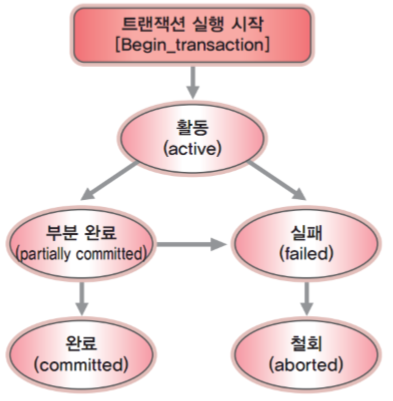

# 트랜잭션(Transaction)

### 트랜잭션이란?

우리가 데이터베이스에 삽입, 수정, 삭제 등의 작업을 할 때, 여러 개의 작업들을 하나의 트랜잭션으로 묶는다.

트랜잭션은 데이터베이스 서버에 여러 개의 클라이언트가 동시에 액세스 하거나 응용프로그램이 갱신을 처리하는 과정에서 중단될 수 있는 경우 등 데이터 부정합을 방지하고나 할 때 사용한다.

트랜잭션(Transaction)이란 **<u>데이터베이스의 상태를 변환</u>시키는 하나의 논리적 기능을 수행하기 위한 작업의 단위** 또는 **한꺼번에 모두 수행되어야 할 일련의 연산**들을 의미한다.

> 데이터의 상태를 변화 시킨다 == 질의어(SQL)를 이용하여 DB에 접근하는 것
>
> : SELECT, INSERT, DELETE, UPDATE
>
> > 작업의 단위는 질의어 한 문장이 아님.

+ DB에서 데이터를 다룰 때 장애가 일어난 경우 데이터를 복구하는 작업의 단위가 된다.
+ DB에서 여러 작업이 동시에 같은 데이터를 다룰 때가 이 작업을 서로 분리하는 단위가 된다.
+ 트랜잭션은 **전체가 수행되거나 또는 전혀 수행되지 않아야 한다**. (All of Nothing)

#### 트랜잭션의 특징

1. 트랜잭션은 데이터베이스 시스템에서 병행 제어 및 회복 작업 시 처리되는 작업의 논리적 단위이다.
2. 사용자가 시스템에 대한 서비스 요구 시 시스템이 응답하기 위하 상태변환 과정의 작업단위이다.
3. 하나의 트랜잭션은 **Commit**되거나 **Rollback**된다.

#### 커밋 (Commit)

> 트랜잭션의 수행이 완료됨을 트랜잭션 관리자에게 알려주는 연산이다.

Commit 연산은 한개의 논리적 단위(트랜잭션)에 대한 작업이 성공적으로 끝났고 데이터베이스가 다시 일관된 상태에 있을 때, 이 트랜잭션이 행한 갱신 연산이 완료된 것을 트랜잭션 관리자에게 알려주는 연산이다.

#### 롤백 (Rollback )

1. Rollback연산은 하나의 트랜잭션 처리가 비정상적으로 종료되어 데이터베이스의 일관성을 깨뜨렸을 때, 이 트랜잭션의 일부가 정상적으로 처리되었더라도 트랜잭션의 원자성을 구현하기 위해 이 트랜잭션이 행한 **모든 연산을 취소(Undo)**하는 연산이다.
2. Rollback시에는 해당 트랜잭션을 재시작하거나 폐기한다.

### 트랜잭션의 ACID 성질

데이터베이스는 일반적인 프로그램과 다르게 4가지의 성질을 지니는데, 이를 **ACID 성질**이라고 한다. 

#### Atomicity(원자성)

> 트랜잭션의 연산은 데이터베이스에 모두 반영되던가, 아니면 전혀 반영되지 않아야 한다

원자성이란 `All of Nothing`의 성질로 **트랜잭션이 원자처럼 더 이상 쪼개지지 않는 하나의 프로그램 단위로 동작해야 한다**는 의미이다. 만약 트랜잭션 단위로 데이터가 처리되지 않는다면, 설계한 사람은 데이터 처리 시스템 이해하기 힘들 뿐만 아니라, 오작동 했을 시 원인을 찾기가 매우 힘들어질 것이다.

1. 트랜잭션 내의 모든 명령은 반드시 완벽히 수행되어야 하며, 모두가 완벽히 수행되지 않고 어느 하나라도 오류가 발생하면 트랜잭션 전부가 취소되어야 한다.

#### Consistency(일관성)

>  트랜잭션의 수행 전과 후에 일관된 상태를 유지해야 한다.

트랜잭션이 진행되는 동안에 **데이터베이스가 변경 되더라도** 업데이트된 데이터베이스로 트랜잭션이 진행되는 것이 아니라, **처음에 트랜잭션을 진행하기 위해 참조한 데이터베이스로 진행**된다. 이렇게 함으로써 각 사용자는 일관성 있는 데이터를 볼 수 있는 것이다.

>  예를 들어 어떤 테이블의 기본키와 같은 속성을 유지되어야 한다는 것 또는 A 에서 B로 돈 이체를 할 때 A와 B계좌의 돈의 총합은 같아야 한다는 것 등이 있다.

1. 트랜잭션이 그 실행을 성공적으로 완료하면 언제나 일관성 있는 데이터베이스 상태로 변환한다.
2. 시스템이 가지고 있는 고정요소는 트랜잭션 수행 전과 트랜잭션 수행 완료 후의 상태가 같아야 한다.

#### Isolation(독립성, 격리성)

> 둘 이상의 트랜잭션이 동시에 변행 실행되는 경우 어느 하나의 트랜잭션 실행중에 다른 트랜잭션의 연산이 끼어들 수 없다.

데이터베이스는 클라이언트들이 같은 데이터를 공유하는 것이 목적이므로 여러 트랜잭션이 동시에 수행되어야 합니다. 이때 **트랜잭션은 상호 간의 존재를 모르고 독립적으로 수행되어야 한다는 것**이 격리성이다. 이를 유지하기 위해서는 여러 트랜잭션이 동시에 접근하는 데이터에 대한 제어가 필요한다. 수행중인 트랜잭션은 완전히 완료될 때까지 다른 트랜잭션에서 수행 결과를 참조할 수 없다.

#### Durability(영속성, 지속성)

> 성공적으로 완료된 트랜잭션의 결과는 시스템이 고장나더라도 영구적으로 반영되어야 한다.

지속성은 **트랜잭션의 성공 결과 값을 장애 발생 후에도 변함없이 보관되어야 한다는 것**이다. 트랜잭션이 정상적으로 완료(Commit)된 경우에는 버퍼의 내용을 하드디스크(데이터베이스)에 확실히 기록하여야 하며, 부분 완료(Partially Committed)된 경우에는 작업을 취소(Aboted)하여야 한다. 즉, **정상적으로 완료 혹은 부분완료된 데이터는 DBMS가 책임지고 데이터베이스에 기록하는 성질**이 지속성이며, 영속성이라고 표현하기도 한다.

### 트랜잭션의 상태

+ 활동(Active) : 트랜잭션이 실행중인 상태
+ 실패(Failed) : 트랜잭션 실행에 오류가 발생하여 중단된 상태
+ 철회(Aborted) : 트랜잭션이 비정상적으로 종료되어 Rollback 연산을 수행한 상태
+ 부분 완료(Partially Committed) : 트랜잭션의 마지막 연산까지 실행했지만, Commit 연산이 실행되기 직전의 상태
+ 완료(Committed) ; 트랜잭션이 성공적으로 종료되어 Commit 연산을 실행한 후의 상태