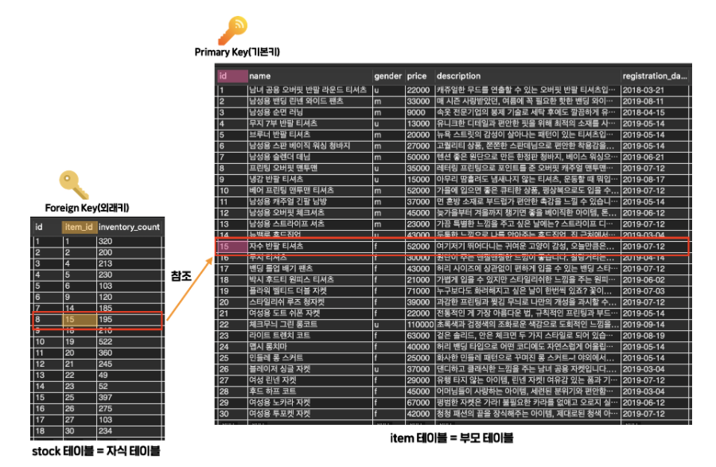

# JOIN

여러 테이블을 합쳐서 하나의 테이블인 것처럼 보는 행위를 JOIN이라고 한다.


### Foreign Key - 외래키

다른 테이블의 특정 row를 식별할 수 있게 해주는 컬럼

+ 참조를 하는 테이블을 '자식 테이블'
+ 참조를 당하는 테이블을 '부모 테이블'

**Foreign Key**는 다른 테이블의 특정 row를 식별할 수 있어야 하기 때문에 주로 **다른 테이블의 PK를 참조할 때가 많다**.



위처럼  JOIN된 관계에서 자식테이블의 `Foreign Key`에 이상한 값을 넣으려고 하면 MySQL이 에러를 발생시킨다.

```mysql
SELECT
	item.id,
	item.name,
	stock.item_id,
	stock.inventory_count
FROM item LEFT OUTER JOIN stock -- 왼쪽에 이름을 쓴 테이블이 기준이 됨.
ON item.id = stock.item_id; -- id와 item_id가 같은 것끼리 연결시켜줌


-- 한번 alias를 붙였으면 다른 모든 절에서 그 테이블은 alias로만 나타내야 한다.
-- 원래의 테이블 이름을 사용하면 오히려 에러가 난다.
SELECT
	i.id,
	i.name,
	s.item_id,
	s.inventory_count
FROM item (AS) i LEFT OUTER JOIN stock (AS) s
ON i.id = s.item_id;
-- 컬럼의 ALIAS는 각 컬럼 이름이 실제로 우리에게 그 alias로 변환되어서 보여지게 하기 위한 용도로 쓰이고,
-- 테이블의 ALIAS는 SQL 문의 전체 길이를 줄여서 가독성을 높이기 위해 사용된다.
```

