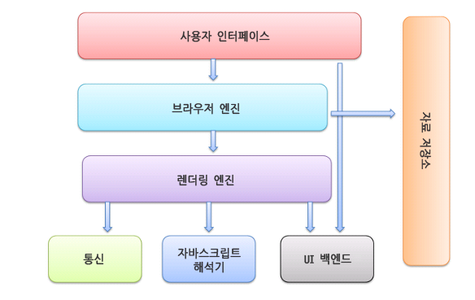

# 1. 인터넷 지식쌓기

## 인터넷

> TCP/IP 프로토콜을 기반으로 하여 전 세계 수많은 컴퓨터와 네트워크들이 연결된 광범위한 컴퓨터 통신망
>
> - 수많은 클라이언트 컴퓨터와 서버 컴퓨터, 그리고 이들로 구성된 <u>네트워크</u>들의 집합체
>
>   > 네트워크 : 여러 컴퓨터가 각각 클라이언트와 서버로써 서로 연결되어 구성된 망

인터넷을 한다 : 웹 브라우저를 통해 외부와 인터넷으로 연결한다

#### 특징

1. 쌍방향 통신

2. 네트워크에 연결만 되어있다면 언제든지 정보 교환 가능

3. 이미지, 음성, 동영상 등 다양한 포맷으로 통신 가능

4. 익명성 제공

5. 유닉스 운영체제 기반

6. 인터넷에 연결된 모든 컴퓨터는 고유 IP를 가짐

7. 컴퓨터 또는 네트워크를 서로 연결하기 위해서는 브리지, 라우터, 게이트웨이 사용

   > 브리지: 물리적으로 다른 네트워크를 연결할 때 사용
   >
   > 라우터: 인터넷 접속시 필수! 각 데이터들이 효율적인 속도로 전송될 수 있도록 데이터 흐름 제어
   >
   > 게이트웨이: 프로토콜이 다른 네트워크를 연결시켜주는 장치. 출입구 역할

#### 인터넷 서비스

+ WWW (World Wide Web)

  >  : 다양한 정보를 거미줄처럼 연결해 놓은 종합 정보 서비스 / HTTP 프로토콜 사용

+ 전자우편 (E-mail)

+ 아키 (Archie) ...

#### 동작 원리

> 상황에 따라서 클라이언트와 서버가 바뀔 수 있음(상대적)

1. 클라이언트가 주소 요청을 보냄

   + 도메인 네임 보냄

   + 도메인 네임과 일치하는 IP를 통해 접속

     -> IP를 통해 서버에 접속

     

2. 서버가 <u>포트</u>를 통해 주소를 받음

   > 포트 : 0번부터 65535번까지의 컴퓨터(클라이언트)에서 서버로 통하는 문을 포트라 함.

____

## 브라우저

> 웹 브라우저 또는 브라우저(browser)

: 인터넷망에서 정보를 검색하는 데 사용하는 응용 프로그램

+ 주요 기능 : 사용자가 선택한 자원을 서버에 요청하고 브라우저에 표시하는것

#### 기본 구조

+ 사용자 인터페이스 : 주소 표시줄, 이전/다음 버튼, 북마크 메뉴 등.

  > 요청한 페이지를 보여주는 창을 제외한 나머지 모든 부분

+ 브라우저 엔진 : 사용자 인터페이스와 렌더링 엔진 사이의 동작 제어

+ 렌더링 엔진 : 요청한 콘텐츠 표시

+ 통신 : HTTP 요청과 같은 네트워크 호출에 사용.

  > 플랫폼 독립적인 인터페이스이고 각 플랫폼 하부에서 실행

+ UI 백엔드 : 플랫폼에서 명시하지 않은 일반적인 인터페이스

+ 자바스크립트 해석기 : 자바스크립트 코드 해석 & 실행

+ 자료 저장소 : 자료를 저장하는 계층. 모든 종류의 자원을 하드 디스크에 저장함.

#### 하는 일

1. 불러오기(loading)

   > HTTP 모듈 또는 파일 시스템으로 전달 받은 리소스 스트림을 읽는 과정
   >
   > -> 로더가 이 역할을 맡고 있음

2. 파싱(parsing)

   > DOM(Document Object Model) 트리를 만드는 과정

3. 렌더링 트리(rendering tree) 만들기

   > 내용 자체를 저장하고 있는 DOM 트리가 있고, **화면에 표시하기 위한 위치와 크기 정보, 그리는 순서 등을 저장하기 위한 별도의 트리구조**를 렌더링 트리라고 함.

4. CSS 스타일 결정

   > HTML의 문서에서 내용과 별도로 표현을 나타내기 위해 만들어짐

5. 레이아웃(layout)

   > 렌더링 트리가 생성될 때, 렌더 객체는 위치나 크기를 갖고 있지 않은데,
   >
   > 각 렌더 객체가 위치와 크기가 갖게 되는 과정을 레이아웃이라고 함

6. 그리기(painting)

   > 렌더링 트리를 탐색하면서 특정 메모리 공간에 RGB 값을 채우는 과정

#### 종류

+ Internet Explorer
+ Firefox
+ Chrome
+ Apple Safari...

____

## 도메인 네임

IP 주소는 0부터 255까지의 십진수 네 개로 구성되어 있어서 외우는 것이 어렵기 때문에 IP주소를 사람이 **기억하기 쉬운 문자 형태**로 표현한 주소를 도메인 네임이라 한다.

도메인 네임은 'naver.com'처럼 몇개의 의미있는 문자들과 점의 조합으로 구성된다.

이러한 도메인 네임은 **네트워크 상에서 각각의 컴퓨터를 식별할 수 있게 해주는 호스트 명**이 된다.

## DNS

> Domain Name System

도메인 네임은 오로지 사람이 외우기 쉽도록 만든 주소로 컴퓨터는 그 의미를 이해할 수 없다.

따라서 도메인 네임을 실제 IP 주소로 변경해 주어야만 컴퓨터가 목적지를 제대로 찾아갈 수 있는데,

이때 사용할 수 있도록 **도메인 네임과 함께 거기에 해당하는 IP 주소값을 한 쌍으로 저장하고 있는 데이터베이스**를 DNS라 하며, 이 변환 과정은 네트워크 내부에서 자동으로 수행된다.

____

## 호스팅

: 정보 집약체인 서버의 전체 혹은 일부를 이용할 수 있도록 임대해 주는 서비스

> 서버를 24시간 365일 켜는 것이 현실적으로 불가능 하므로 호스팅 업체가 여러 대의 서버로 이용자들에게 임대해 주고 그 대가를 받는 서비스

> 개인이 서버를 관리하기보다 전문 업체의 호스팅 서비스를 사용하는 것이 일반적 

#### 종류

+ 웹 호스팅

  : 여러 고객이 하나의 서버를 함께 사용하는 형태

  > 장) 하나의 서버를 나누어 쓰기 때문에 저렴, 호스팅 업체의 통합 관리를 받기에 편리
  >
  > 단) 사용할 수 있는 하드웨어가 제한적

+ 서버 호스팅

  : 고객이 단독 서버를 사용하는 형태

  > 장) 넓은 하드웨어 공간을 사용, 서버 운영/관리에 대한 직접적인 권한을 가질 수 있음. 빠른 데이터 전송 속도도 누릴 수 있음
  >
  > 단) 단독으로 서버를 이용하는만큼 비용이 높음

+ 클라우드 서버

  : 서버 호스팅을 가상화한 것으로, 가상 서버를 단독으로 사용할 수 있는 형태

  > 장) 고객이 필요할 때마다 서버 자원을 늘리거나 축소하여 유연하게 서버를 이용할 수 있음
  >
  > 단) 하나의 가상 서버에 문제가 생기면 연결된 다른 가상 서버에도 문제가 생길 수 있음

