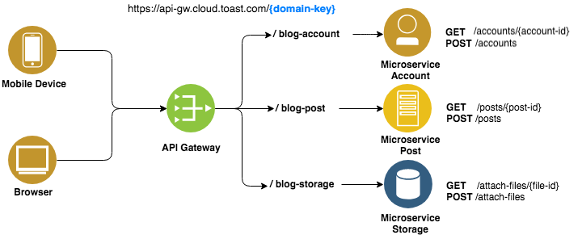

# API Gateway

API 게이트웨이는 클라이언트와 서비스 사이에 배치한다.

게이트웨이를 배포하지 않으면 클라이언트는 프론트엔드 서비스로 직접 요청을 보내야 한다. 하지만 서비스를 클라이언트에 직접 노출하는 데에는 몇 가지 문제가 있다.

마이크로서비스 아키텍처의 나눠진 많은 서비스들을 효율적으로 사용하기 위해 API Gateway를 사용한다.

> 꼭 MSA가 아니더라도 일반적으로 API Gateway를 사용한다.
>
> 그냥 서버만 열어도 어떻게 보면 api gateway가 될 수 있으며, nginx도 api gateway이다.

API Gateway를 이용함으로써 통합적으로 엔드포인트와 REST API를 관리할 수 있다. 

API Gateway는 서비스로 전달되는 모든 API요청의 관문 역할을 하는 서버로서, 시스템의 아키텍처(구조)를 내부로 숨기고 외부의 요청에 대한 응답만을 적절한 형태로 응답하게끔한다.

즉, 클라이언트는 내부 구조를 알 필요 없이 서로 약속한 형태의 API 요청만을 서버로 보내면 된다.

#### API Gateway 기능

+ OAuth

  + 사용자가 개인 정보를 공유하지 않아도 사용자 데이터에 액세스할 수 있다.

+ CORS

  + CORS는 앱이 API 액세스 도메인 경계에서 데이터를 검색할 수 있도록 HTTP 헤더를 사용하는 것.

  + API에서 CORS를 사용으로 설정하지 않으면 같은 도메인에 있는 앱에만 데이터를 리턴할 수 있다.

+ 비율 제한
  + 애플리케이션에서 API를 호출할 수 있는 수를 관리하는 비율 제한을 적용할 수 있다.
  + 초, 분 또는 시간 당 허용된 수만 호출할 수 있도록 비율 제한을 지정할 수 있다.

#### API Gateway의 장점

+ 클라이언트의 요청을 일괄적으로 처리
+ 시스템 내부에 아키텍처를 숨길 수 있음

API Gateway를 이용하면 서비스 요청에 대한 처리를 하게되면 특정 서비스의 변경사항이 생기거나 서비스가 통합/분리 되더라도 클라이언트는 그 사실을 인지할 필요 없이 API Gateway 내부의 변경사항만으로 처리가 가능하다.

