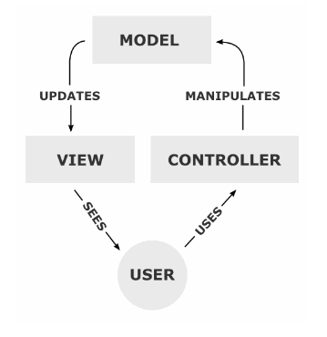
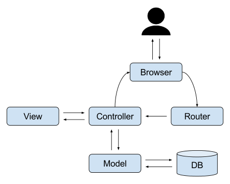

# MVC 패턴

### Model View Controller 패턴(디자인 패턴 중 하나)

==> **각각 맡은바에만 집중할 수 있게 함**

## 디자인 패턴

> 객체 지향 프로그래밍설계를 할 때 **자주 발생하는 문제들을 피하기 위해    사용되는 패턴**
>
> 문제점들을 정리해서 상황에 따라 간편하게 적용해서 쓸 수 있는 것을 정리하여 특정한     "규약"을 통해 쉽게 쓸 수 있는 형태로 만든 것을 말합니다.
>
> ->> 패턴은 개발 할 때 서로 간에 공통되는 설계 문제와, 이를 처리하는 해결책 사이의 공통점(유사점)을 말한다.

+ 개발자 간의 원활한 의사소통 가능케 함
+ 설계 변경 요청에 대한 유연한 대처-> 유지보수 간편
+ 재사용을 통한 개발 시간 단축

## MVC 패턴이란?

(Model View Controller 패턴)

: 애플리케이션을 세가지의 역할로 구분한 개발 방법론

MVC 모델 덕분에 디자이너들이 뷰 영역을 디자인하는 동안 개발자들은 컨트롤러와 모델 코드를 작성할 수 있게 되었다. 또한 개발자가 코드를 변경하더라도 뷰에 영향을 미치지 않는 장점이 생겼다.

또한 모델의 코드를 모듈화하고, 모듈화된 코드를 컨트롤러로 제어하는 MVC 모델 덕분에 여러 개발자들이 협력해서 병렬적으로 코드를 작성할 수 있게 되었다.

-> **각각 맡은 바에만 집중할 수 있게 함(삼권분립)**

`Model` : 정보, 데이터 나타냄

`View` : 데이터 및 객체의 입력, 출력을 담당

`Controller` :  요소들을 잇는 다리 역할

-> 유지보수성, 애플리케이션의 확장성, 그리고 유연성이 증가하고, 중복코딩이라는 문제점 또한 사라지게 되는 것임.

뷰를 위한 코드로는 HTML, CSS, JavaScript 등이 있고, 모델과 컨트롤러는 Java, Python 등의 언어로 작성된다.

____

>  Model 1 방식  : JSP(java server pages)에서 출력과 로직 모두 처리

> Model 2 방식 : JSP에서 출력만 처리

-> Cotroller를 조작하면 Controller는 Model을 통해서 데이터를 가져오고 그 정보를 바탕으로 시각적인 표현을 담당하는 View를 제어해서 사용자에게 전달.

(일단은 브라우저에서 컨트롤러로 바로 요청을 보낸다고 생각하기)

(근데 라우터랑 브라우저랑 다름.)

### Model  : 백그라운드에서 동작하는 로직을 처리(일꾼1)

+ 사용자가 편집하길 원하는 **모든 데이터(DB)를 가지고 있어야 함**.
+ 뷰나 컨트롤러에 대해서 알면 안됨.
+ 변경사항이 있을 때, 변경 통지에 대한 **처리 방법을 구현**해야 함.

> +데이터 베이스(DB)->> 체계적인 데이터의 모음
>
> : **여러 사람이 공유하여 사용할 목적**으로 체게화해 통합, 관리하는 데이터의 집합이다.  데이터 베이스를 통해서 연관된 데이터들을 구조화함으로써 검색과 갱신의 효율화를 이룰 수 있다.

> 모델을 쉽게 생각하면 공장이다. 모델에서 데이터를 가공하고, 컨트롤러라는 회사로 물건을 보내준다. 근데 의뢰가 와서 일을 했을 뿐, 컨트롤러가 뭐하는지는 모름
>
> 혹시 이것도 이해가 안되면, 컨트롤러는 사장, 모델은 일꾼이라고 생각하자.

### View :    데이터 및 객체의 입력, 출력을 담당(일꾼2)

+ 모델이 가지고 있는 정보를 따로 저장해서는 안됨.

  -> 화면에 글자를 표시하기 위해 모델이 가지고 있는 정보를 전달받은 후, 유지하기 위해 임의의 뷰 내부에 저장하면 안됨. **표시만 하자**

+ 모델이나 컨트롤러와 같이 다른 구성요소들을 몰라야 함.

  ->  자기 자신빼고는 다른 요소가 어떻게 참조하고 동작하는지 모름

+ 변경사항이 있을 때, 변경 통지에 대한 **처리 방법을 구현**해야 함.

  -> 사용자가 화면에 표시된 내용을 변경하게 되면 이를 모델에게 전달함

### CONTROLLER : 사용자의 입력처리와 흐름 제어 담당(사장)

+ 모델이나 뷰에 대해서 알고 있어야 함.(혼자만 알아U)

  -> 수신방법만 가지고 있는 모델과 뷰를 중재하기 위함.

+ 모델이나 뷰의 변경을 모니터링 해야함.

  ->  변경 통지 받은 것을 해석해서 각각의 구성요소에게 통지하고, 애플리케이션의 메인 <u>로직</u>은 컨트롤러가 담당함.

  > 논리적 흐름?
  >
  > 특별한 작업을 수행하기 위해 준비된 컴퓨터에서 사용되는 원리의 집합이나 시스템

==> 데이터와 사용자인터페이스 요소들을 잇는 다리 역할!

​		사용자가 데이터를 클릭하고 수정하는 것에 대한 '이벤트'들을 처리

____

--> 총정리를 해 봅시다

MVC 패턴은 디자인 패턴(자주 발생하는 문제를 해결하기 위해 사용되는 패턴) 중 하나로, model view controller의 약자이다. 

model은 사용자가 원하는 데이터를 모두 갖고 있으며, view나 controller에 대해서 모른다. 또한 변경사항이 있을 때 처리 방법을 구현해야 한다. 

> 동적인 웹페이지를 위한 코드

view는 모델에 포함된 데이터의 시각화 담당, model이 갖고 있는 정보를 몰라야 한다.(just 실행만 하나봄. ) model과 controller에 대한 정보를 몰라야 하며, 이것도 변경사항이 있으면 처리방법을 구현해야 함.

> 화면에 보이게 함

controller는 다리역할을 하는데, 얘는 신처럼 model이나 view에 대한 정보를 싸그리 알고 있음. 근데 얘는 뭘 실행하는건 아니고 전달해주는 역할 임.

> 사용자의 입력에 따라 모델을 컨트롤함

____

spring에서는 view와 controller 역할을 `controller`에서 하고, model은 비즈니스 로직(serviceImpl과 같은 구현체)과 `Entity`를 말한다.

