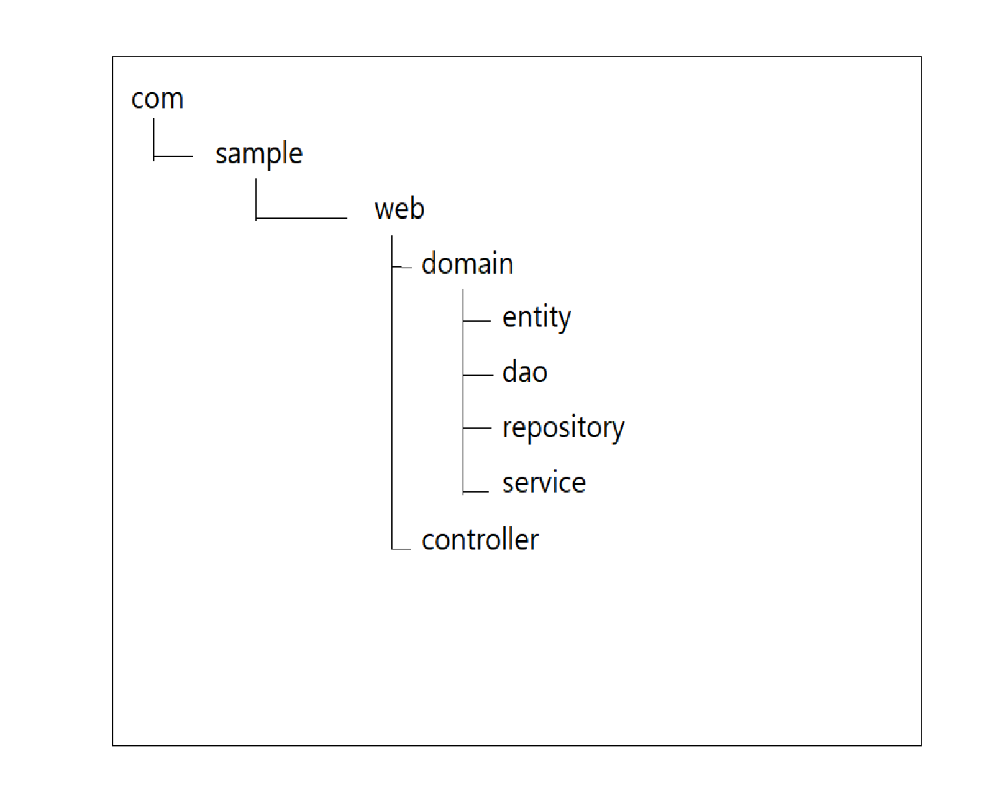

## 스프링 부트란?

> 그 자체로 완전한 프레임워크는 아님. 스프링 MVC 프레임워크를 사용하여 개발한다

프로덕션 환경에서 실행할 수 있는 애플리케이션 개발을 쉽고 빠르게 할 수 있다. 서드파티 라이브러리나 스프링 플랫폼 설정이 처음부터 들어 있어 최소한의 작업으로 개발을 시작할 수 있다.


### 1. 스프링의 특징

### 1-1. 스타터

스타터는 의존관계를 세트로 간단하게 정의하는 모듈(구성 요소)이다.


아래의 스타터는 자주 사용하는 예이다.

+ `spring-boot-starter-web` : 스프링 MVC 또는 톰캣 등 웹 애플리케이션에 필요한 라이브러리가 의존관계에 추가됨.
+ `spring-boot-starter-jdbc` : 스프링 JDBC, 톰캣 JDBC 커넥션 풀이 의존관계에 추가됨.


### 1-2. 빌드 도구

빌드 도구는 버전 해결 등 개발을 효율화하는 <u>플러그인</u>이다.

> 플러그인(plugin) : 기존 애플리케이션의 기능을 확장해 주는 것

스프링 부트는 아파치 메이븐 또는 그레이들 사용을 권장한다. 


### 1-3. 의존 관계 관리

스프링 부트의 릴리스(배포)에는 일련의 의존관계가 정의되어 있어 모든 라이브러리의 버전을 하나씩 지정할 필요 없다. 

`ext`는 그레이들의 확장 속성이다. 확장 속성에 각 라이브러리의 버전이 설정되어 있어 사용할 라이브러리의 버전을 변경하려면 버전값을 덮어 써야 한다.


### 1-4. 구성 클래스

스프링 부트는 자바 기반으로 구성하는 것을 선호한다. XML 파일에 작성할 수도 있지만, 스프링 부트는 `@Configuration`을 부여한 클래스로 구성하는 것을 권장한다.

구성 클래스는 꼭 하나의 클래스로 만들 필요 없다. 

```java
@Configuration
public class ApplicationConfig implements WebMvcConfigurer{
}

@SpringBootApplication(scanBasePackages = {"com.sample.web"})
public class Application{
	public static void main(String[] args){
		SpringApplication.run(Application.class, args);
	}
}
```


### 1-5. 자동 구성

스프링 부트는 설정을 변경하지 않으면 미리 정해진 디폴트 설정에 따라 동작한다. 이는 자동 구성 기능이 디폴트 동작을 설정한 것이다.


자동 구성을 사용하려면 `@EnableAutoConfiguration` 또는 `@SpringBootApplication`을 부여한다.

`@EnableAutoConfiguration`은 여러 번 부여할 수 없기 때문에 기본 구성 클래스에 부여할 것을 권장한다.


자동 구성은 개발자가 직접 명시한 구성을 덮어 쓰지 않는다. 데이터베이스에 대한 접속 설정을 정의하면 디폴트의 내장형 데이터베이스는 자동 구성 대상에서 제외된다.


### 1-7. 메인 애플리케이션 클래스

메인 애플리케이션 클래스는 스프링 부트의 애플리케이션을 실행하는 메소드를 호출한다.

메인 애플리케이션 클래스는 디폴트 패키지가 아닌 루트 패키지에 배치할 것을 권장한다.


전형적인 디렉터리 구성은 다음과 같다




### 1-8. 설정파일

`application.properties`

