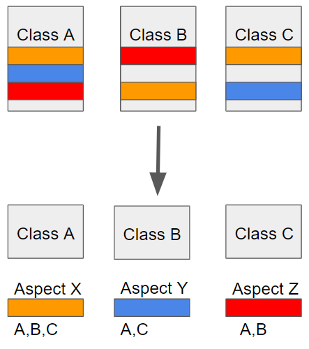

# AOP

> Aspect Oriented Programing : 관점 지향 프로그래밍


Spring은 <u>Spring Triangle</u>이라고 부르는 세 가지 개념 Ioc, AOP, PSA를 제공해준다.

> 스프링의 기반이 되는 설계 개념을 표현한 것


관점 지향은 쉽게 말해 **어떤 로직을 기준으로 핵심적인 관점, 부가적인 관점으로 나누어서 보고 그 관점을 기준으로 각각 모듈화하겠다는 것이다.** 여기서 모듈화란 어떤 공통된 로직이나 기능을 하나의 단위로 묶는 것을 말한다.

> 모듈화(Modularization) : 프로그램 제작시 생산성과 최적화, 관리에 용이하게 모듈(기능) 단위로 분할하는 것


**AOP 방법은 핵심 기능과 공통 기능을 분리** 시켜놓고, 공통 기능을 필요로 하는 핵심 기능들에서 사용하는 방식이다. 핵심 기능은 변화하지만, 공통기능은 다시 적용이 가능하다.


 예로 들어 핵심적인 관점은 결국 우리가 적용하고자 하는 핵심 비즈니스 로직이 된다. 또한 부가적인 관점은 핵심 로직을 실행하기 위해서 행해지는 데이터베이스 연결, 로깅, 파일 입출력 등을 예로 들 수 있다.




AOP에서 각 관점을 기준으로 로직을 모듈화한다는 것은 코드들을 부분적으로 나누어서 모듈화하겠다는 의미이다. 이때, 소스 코드상에서 다른 부분에 계속 반복해서 쓰는 코드들을 발견할 수 있는 데 이것을 **흩어진 관심사(Crosscutting Concerns)**라고 한다.

위와 같이 흩어진 관심사를 **Aspect로 모듈화하고 핵심적인 비즈니스 로직에서 분리하여 재사용하겠다**는 것이 AOP의 취지이다.


### AOP 주요 개념

+ `Aspect` : 여러 곳에서 쓰이는 흩어진 관심사를 모듈화 한 것.

  > 주로 부가기능을 모듈화함.

+ `Target` : Aspect를 적용하는 곳(클래스, 메소드 . . )

+ `Advice` : 실질적으로 **어떤 일을 해야할 지**에 대한 것, 실질적인 부가**기능**을 담은 구현체

+ `JointPoint` : Advice가 적용될 위치(Target), 끼어들 수 있는 지점. 

  > 메소드 진입 지점, 생성자 호출 시점, 필드에서 값을 꺼내올 때 등 다양한 시점에 적용가능

+ `PointCut` : JointPoint의 상세한 스펙을 정의한 것.

  > 'A란 메소드의 진입 시점에 호출할 것'과 같이 더욱 구체적으로 Advice가 실행될 지점을 정할 수 있음


### 스프링 AOP 특징

> AOP 적용 방법 : 런타임(스프링 AOP)

+ <u>proxy 패턴</u> 기반의 AOP 구현체, 프록시 객체를 쓰는 이유는 접근 제어 및 부가기능을 추가하기 위해서임

  > 일반적으로 프록시는 다른 무언가와 이어지는 인터페이스의 역할을 하는 클래스를 말한다.
  >
  > 프록시 패턴을 사용하면 어떤 기능을 추가하려 할 때 기존 코드를 변경하지 않고 기능을 추가할 수 있다

+ 스프링 빈에만 AOP를 적용 가능

+ 동적 프록시 빈을 만들어 등록시켜준다

  + 빈 라이프사이클 중 실행되는 `BeanPostProcessor` 구현체를 구현함

    ```java
    AbstractAutoProxyCreator implements BeanPostProcessor
    ```

    

