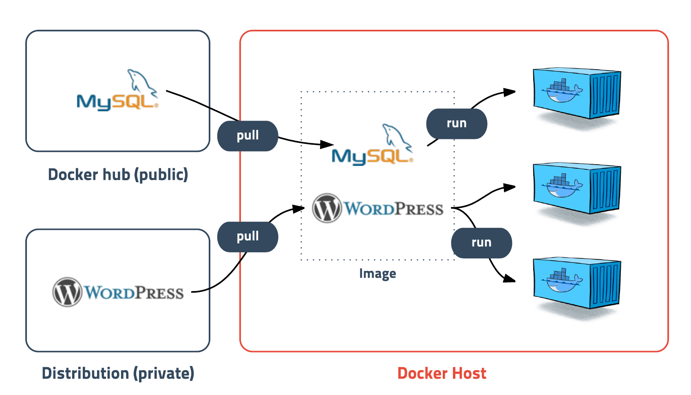

# 도커(Docker)

도커는 **컨테이너 기반의 오픈소스 가상화 플랫폼**이다.


Docker는 코드를 실행하는 표준 방식을 제공하는 컨테이너를 위한 운영 체제이다. VM이 서버 하드웨어를 가상화하는 방식과 비슷하게(직접 관리해야 하는 필요성 제거) 컨테이너는 서버 운영 체제를 가상화한다. Docker는 각 서버에 설치되며 컨테이너를 구축, 시작 또는 중단하는 데 사용할 수 있는 간단한 명령을 제공한다.

Docker 이미지에 서버 운영에 필요한 프로그램과 라이브러리만 격리해서 설치할 수 있고, OS 자원은 호스트와 공유한다. 이렇게 되면서 이미지 용량이 크게 줄었다


서버에서 이야기하는 `컨테이너`는 다양한 프로그램, 실행환경을 컨테이너로 **추상화**하고 동일한 인터페이스를 제공하여 프로그램의 배포 및 관리를 단순하게 해준다. 백엔드 프로그램, 데이터베이스 서버 등 어떤 프로그램도 컨테이너로 추상화할 수 있고 조립 PC, AWS, Google cloud 등 어디에서든 실행할 수 있다.


컨테이너는 격리된 공간에서 프로세스가 동작하는 기술이다. 가상화 기술 중 하나이지만 기존의 방식과 다르게 **프로세스를 격리**하는 방식으로 동작한다.

하나의 서버에 여러 개의 컨테이너를 실행하면 서로 영향을 미치지 않고 독립적으로 실행되어 마치 가벼운 VM(Virtual Machine)을 사용하는 느낌을 준다.


Docker를 사용하면 

+ 코드를 더 빨리 전달하고, 애플리케이션 운영을 표준화하고, 코드를 원활하게 이동하고, 리소스 사용률을 높여 비용을 절감할 수 있다
+ 어디서나 안정적으로 실행할 수 있는 단일 객체를 확보하게 된다




도커에서 가장 중요한 개념인 **이미지**는 **컨테이너 실행에 필요한 파일과 설정값 등을 포함하고 있는 것**이다.

 같은 이미지에서 여러 개의 컨테이너를 생성할 수 있고, 컨테이너의 상태가 바뀌거나 혹은 컨테이너가 삭제된다 하더라도 이미지는 변하지 않고 상태를 유지한다. 즉, 이미지는 컨테이너를 실행하기 위한 모든 정보들을 가지고 있기 때문에 서버를 추가하는 작업을 해도 이미지를 다운받아 컨테이너를 생성 및 실행만 하면 완료된다.

```
// 풀 받아진 이미지의 이름 예시
docker.io/library[namespace/사용자 이름]/nginx[image_name]:latest[tag]
```


도커의 이미지 용량은 엄청 거대하며 메가에서 시작하여 기가 단위로 넘어가는 경우도 있다고 한다. 이런 큰 용량의 이미지를 **Docker hub**를 통해 공개 이미지를 무료로 관리해준다

Docker hub는 Github처럼 Docker 이미지를 공유할 수 있는 기능과 개인 저장소를 제공한다

