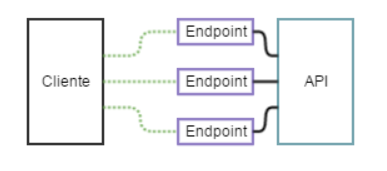

# API와 ENDPOINT

### API

API는 점원과 같은 역할을 한다고 보면 된다. 

손님(프로그램)이 주문할 수 있게 메뉴(명령 목록)를 정리하고, 주문(명령)을 받으면 요리사(응용프로그램)와 상호작용하여 요청된 메뉴(명령에 대한 값)를 전달한다.

> 쉽게 말해 API는 웹서비스와 특정 기술을 연결해주는 징검다리 역할이다

#### 역할

1. API는 서버와 데이터베이스에 대한 출입구 역할을 한다.

   > 허용된 사람들에게만 접근성을 부여해준다

2. API는 애플리케이션과 기기가 원활하게 통신할 수 있도록 한다

   > 여기서 말하는 애플리케이션은 흔히 말하는 '앱'이다

3. API는 모든 접속을 표준화한다.

   > 쉽게 말해 범용 플러그처럼 작동한다.

#### REST API

REST API는 REST 방식이 쓰인 API를 말한다.

REST는 HTTP 기반으로 필요한 자원에 접근하는 방식을 정해놓은 아키텍처(설계도)이다.

REST의 구성요소는 `자원(resource)`, `method`, `message` 세 가지로 구성되어 있습니다.

REST는 자원에 접근할 때 URI(Uniform Resource Identifier)로 한다.

1. '/'는 계층 관계를 나타내는 데 사용하며, URI 마지막 문자로 포함하지 않는다
2. URI를 이루는 resource들은 동사보다는 명사로 이루어져야 하며, 소문자가 적합하다
3. URI에는 '_'보다는 '-' 사용을 권장한다
4. 파일 확장자는 URI에 포함시키지 않는다

#### ENDPOINT

클라우드에 공개된 **API를 실행하기 위해 접속하는 연결 접점**을 엔드포인트라고 한다. 엔드포인트는 `FQDN`으로 표현되는데 API의 접점으로 일종의 `게이트웨이` 역할을 한다.

>  웹 서비스 엔드포인트는 클라이언트 응용 프로그램에서 **서비스에 액세스할 수 있는 URL**이다.
>
> (실제 URL !!)

>  여기서 엔드포인트는 API와 소비자 응용프로그램 간의 인터페이스입니다.

클라우드 환경에서는 인프라 컴포넌트를 제어하기 위해 엔드포인트에 접속한다.

엔드포인트는 주로 IP주소가 아닌 도메인으로 접속을 한다.

+ 도메인을 씀으로써 IP 주소가 아닌 도메인으로 접속을 한다
+ IP 주소가 바뀔 때 자동으로 바뀐 IP 주소로 접속하도록 할 수 있다

##### FQDN

> Fully Qualified Domain Name : 전체 주소 도메인 네임

소유한 도메인 중에, SSL 인증서를 적용하려면 적용대상 FQDN을 정확히 이해를 하고 발급 신청을 해야만 착오를 줄일 수 있다. 

SSL에서는  URL과 도메인은 서로 의미가 다르다. 그래서 이런 모호함을 없애기 위해서 FQDN이란 단어가 필요하다. www가 붙은 것과 안 붙은 것은 엄연히 다르며 절대 같은 도메인이 아니다. 글자 한자라도 다르면 별개이며, 엄격하게 구분한다.

##### Gateway

+ 컴퓨터 네트워크에서 Gateway란 **한 네트워크(segment)에서 다른 네트워크 이동하기 위하여 거쳐야 하는 지점**이다

  > 서로 다른 네트워크의 프로토콜이 다를 경우에 중재 역할을 해 준다.
  >
  > > 게이트 웨이는 다른 언어를 사용하는 두 사람 사이에 통역사나 번역기와 비슷한 느낌

결국 API란 두 시스템, 애플리케이션이 상호작용(소통)할 수 있게 하는 프로토콜의 총 집합이라면, ENDPOINT란 API가 서버에서 리소스에 접근할 수 있도록 가능하게 하는 URL이다.