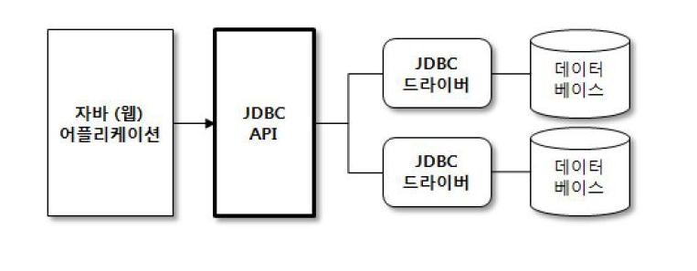

# JDBC란?

JDBC(Java DataBase Connectivity)는 자바에서 데이터베이스에 접속하여 데이터를 주고 받을 수 있게 하는 자바 API이다. (DB 종류에 상관 없다)

JDBC는 **데이터베이스에서 자료를 쿼리하거나 업데이트하는 방법을 제공**한다.

> 통역자의 역할: 응용프로그램과 DBMS간의 통신을 중간에서 번역해주는 역할을 한다

### JDBC Driver

: DBMS와 통신을 담당하는 자바 클래스

DBMS 별로 알맞은 JDBC 드라이버가 필요하다.

> MySQL : com.mysql.jdbc.Driver

### JDBC URL

: DBMS와의 연결을 위한 식별 값

JDBC 드라이버에 따라 형식이 다르다.

> jdbc[DBMS]:[데이터베이스 식별자]

> MySQL : Jdbc:mysql//HOST[:PORT]/DBNAME[?param=value&param1=value2&...]

### 환경 설정

spring boot 설정 _ gradle

`implementation 'org.spring.framework.boot:spring-boot-starter-jdbc'`

